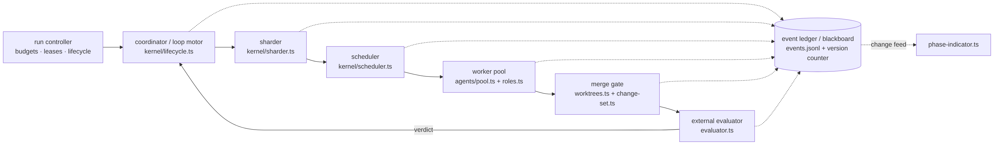
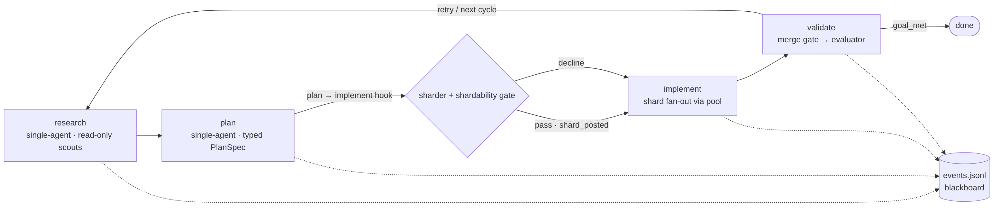
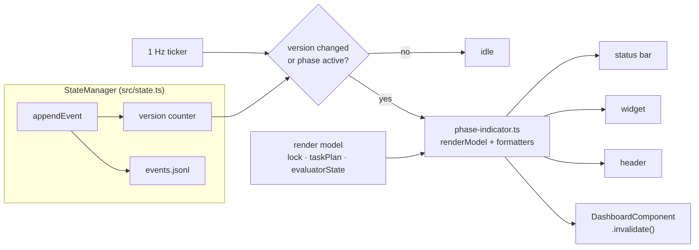
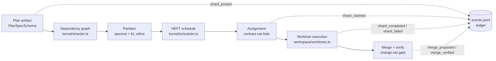
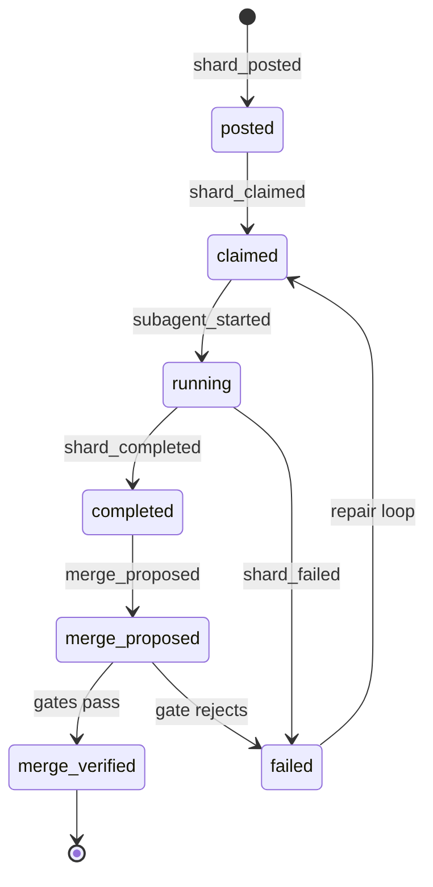

# pi-iterative-goal: Harness Efficacy Deployment Plan

**Repository:** `joeott/pi-iterative-goal` @ `main` (`c6a3b75`)
**Date:** 2026-07-20
**Scope:** UI phase visibility, swarming capabilities, post-plan sharding — architecture, externally validated pattern proof, and a gated five-campaign rollout.

---

# 1. Executive Summary

This document is a deployment plan for `joeott/pi-iterative-goal`, a TypeScript extension that drives the Pi Coding Agent through an autonomous four-phase supervisor loop — research, plan, implement, validate — gated by an external evaluator. Every repository claim is pinned to `main` @ `c6a3b75`; every design claim traces to a verified seam, a dormant asset, or a named gap.

### The ask and the finding

The engineering owner asked for three capabilities the harness lacks today: clean, live rendering of the current phase in the Pi terminal user interface (TUI); swarming — supervisor fan-out to specialist subagents; and effective sharding of implementation work once research and planning complete. The current-state assessment (Chapter 2) returns the plan's decisive finding: most of the required machinery already ships in dormant form. The typed plan model `PlanSpecSchema`, the bounded-concurrency primitive `AgentPool.map`, the dependency-graph field `AgentTask.dependsOn`, the user-facing `mode` fan-out switch, the git-worktree isolation primitive, and the hash-chained event ledger are all verified present at the pinned commit and consumed by nothing. The deployment is therefore wiring and promotion, not greenfield construction — which concentrates risk at integration seams already covered by the repository's own smoke and headless test runners.

### What gets built

UI visibility lands as a single renderer, `src/ui/phase-indicator.ts`, fed by a monotonic version counter inside the event-sourced StateManager and a 1 Hz ticker — the first interval timer in `src/`. Phase, elapsed time, evaluator state, and task progress repaint within one second, and six verified rendering defects collapse into one ownership fix (Chapter 4).

Swarming lands by wiring the dead `mode` parameter of `goal_subagent` to `AgentPool.map` and promoting the pool to a long-lived per-run instance with a cross-call write-scope registry, per-role tool and budget profiles, and ledger plus TUI visibility for every subagent run. The single-agent fallback contract is preserved throughout, so a swarm with no working backend degrades to today's behavior (Chapter 5).

Post-plan sharding lands as three modules: `src/kernel/sharder.ts` (spectral-seeded partitioning with local refinement), `src/kernel/scheduler.ts` (HEFT scheduling with contract-net assignment), and `src/workspace/worktrees.ts` (worktree isolation with patch merge-back and a three-part merge gate) (Chapter 6). Five diagrams anchor the design: D1, the instrumented loop, and D2, the deployment topology, live in Chapter 3; D3, the UI change-feed data flow, in Chapter 4; D4, the sharding pipeline, and D5, the shard lifecycle, in Chapter 6.

### Why this is credible

Each orchestration pattern passed a symmetric evidence review that sought the strongest support and the strongest counter-evidence (Chapter 7). HEFT (Heterogeneous Earliest Finish Time) scheduling, spectral partitioning as a component, and LLM-as-judge gating under bias controls rate STRONG. Multi-agent orchestration rates MODERATE and explicitly task-dependent: the headline support is a 90.2% gain on a vendor-internal research evaluation [^1^], balanced against 4–15× token costs and a peer-reviewed taxonomy of fourteen multi-agent failure modes [^2^]. Wherever the evidence is conditional, the condition ships as enforced code — telemetry-calibrated costs, prior-plus-refinement, bounded bidding — not as documentation.

### How it ships

Five campaigns, each independently shippable, each gated by extensions to the existing `npm run smoke` and `npm run evidence:headless` runners (Chapter 8). C0 lands UI eventing first: additive, zero loop-motor risk, and the observability substrate for everything after. C1 wires the swarm behind a feature flag and must beat the single-agent baseline before default enablement. C2 adds the sharder, C3 the scheduler, and C4 merge-back with signed evidence. Rollback is a revert for C0 and a flag-flip thereafter.

### The central control

The plan's closing discipline is the shardability gate (Chapter 9). Multi-agent machinery is a force multiplier for decomposable work and a cost-and-fragility multiplier for coupled work: the fan-out that parallelizes six cleanly separated files will, on coupled code, burn an order of magnitude more tokens and produce a merge no conflicted judge can certify. Two mechanisms keep the deployment on the right side of that line. The sequencing invariant permits sharding only after the research and plan artifacts commit, so decomposition never runs ahead of understanding. The gate itself inspects coupling density before any fan-out and may say no, demoting the implement phase to its single-slice path at zero cost. "Do not shard" is a successful outcome of this plan, not a failed ambition.

# 2. Current-State Assessment

This chapter fixes the verified baseline against which the deployment plan is sized. All repository claims derive from a read-in-full pass over the loop, UI, agent-pool, state, capability, and policy modules of `joeott/pi-iterative-goal` at `main` @ `c6a3b75` (2026-06-29), cited inline as `src/file.ts → symbol`. Section 2.1 inventories the strengths worth building on, Section 2.2 enumerates the twelve gaps (G1–G6, S1–S6) that Chapters 4–6 close, and Section 2.3 presents the central finding: the repository already ships most of the contracts the target architecture needs, unwired.

## 2.1 The four-phase loop and its verified strengths

The extension implements an autonomous supervisor loop — research → plan → implement → validate, gated by an external evaluator — driven by `src/kernel/lifecycle.ts` (loop motor) and `src/kernel/workflow-engine.ts` (phase attempts and model health). Five properties of this substrate are load-bearing for everything later chapters propose.

**Event-sourced, hash-chained ledger.** `src/state.ts → createStateManager(pi)` maintains `.pi/iterative-goal/runs/<runId>/events.jsonl` as the authoritative append-only record: `appendEvent` attaches `sequence`, `previousEventHash`, and a sha256 `eventHash`, and `verifyEventHashChain` fails closed on tamper. `replayEvents()` rebuilds state via a `replayHandlers` table; `restore()` prefers replay, falls back to the `state.json` snapshot, then to a session-level envelope that survives compaction. Side ledgers (`evaluator-verdicts.jsonl`, `approvals.jsonl`, `attestations.jsonl`, `task-plan.jsonl`) and per-phase artifact directories (`cycles/<n>/<phase>/`) keep every attempt auditable via `/goal-audit`, `/goal-replay`, and `/goal-trace` (`src/ui/commands.ts`). The taxonomy already covers loop lifecycle (`phase_attempt_started/completed`, `verdict_recorded`, `evaluator_state_updated`, `task_plan_updated`), so shard and subagent coordination events extend an existing table rather than requiring a new storage layer.

**Policy engine and capability gating.** Every privileged effect passes through `src/capabilities/broker.ts → CapabilityBroker.invoke`, gated by `src/policy/engine.ts → PolicyEngine`. The policy vocabulary is already shard-shaped: the `Effect` union spans `fs.*`, `process.exec`, `git.*`, and `cloud.*`; `ActionRequest.taskId?` names the requesting task; and `PolicyDecision.lease?: CapabilityLease` carries `{ runId, taskId?, effect, resource, maxUses, expiresAt }` — bounded, expiring, per-task grants.

**Capability preflight with graceful degradation.** `src/capabilities.ts → detectSubagentBackend()` probes tool and command backends before any fan-out. When `commandExists("pi")` fails, the subagent tool returns structured single-agent-fallback output (`details.fallback=true`) instead of an error (`src/subagents.ts → registerGoalSubagentTool`), and `/goal-repair-capabilities` (`src/ui/goal-commands.ts`) exposes a remediation path. Preflight plus soft fallback is behavior later swarm designs must preserve, not reinvent.

**Worktree isolation primitive.** `src/agents/pool.ts → prepareIsolatedWorktree()` performs a detached `git worktree add` into `os.tmpdir()`, captures results as `git diff --binary` via `capturePatch()`, and guarantees cleanup through `git worktree remove --force` plus a process-exit cleanup registry. This is precisely the isolation unit shard execution requires; what it lacks is lifecycle management beyond a single tool call (Section 2.2).

**Headless evidence runners.** `scripts/smoke-goal-harness.mjs` (~27 tests) and `scripts/headless-feature-evidence.mjs` (`npm run evidence:headless`) supply runnable acceptance gates outside the interactive TUI; every rollout campaign in Chapter 8 terminates in one of them, so acceptance infrastructure is consumed, not built.

A final semantic constrains all later designs: the evaluator's unfinished-work gate — `src/evaluator.ts` blocks goal completion while any `TaskPlanItem` is pending, in_progress, or blocked — must be preserved exactly by any shard-aware rework of the checklist.

## 2.2 Gap analysis

The gaps fall into two clusters — UI visibility (G1–G6) and the swarm substrate (S1–S6) — followed by the sharding seams, where attach points exist but the machinery is absent. Gap IDs are stable references: each is closed by a named design element in Chapters 4–6.

| Gap ID | Location | Symptom | Deployment impact |
|---|---|---|---|
| G1 | `src/harness-ui.ts → HarnessHeader` | Re-renders only on `session_start`/`model_select`; `invalidate()` is a no-op | Most prominent phase display is wrong for the entire run |
| G2 | `src/kernel/lifecycle.ts`, `src/state.ts` | Repaint only at transitions; no `setInterval` in `src/`; `startPhaseAttempt()` never touches UI | Long phases show no liveness; running is indistinguishable from hung |
| G3 | `src/dashboard.ts → updateStatusBar`/`updateWidget` | Status bar and widget read only `lastVerdict`; `evaluatorState` (`queued`/`running`/…) visible only in the modal dashboard and `/goal-status --json` | Evaluator latency is invisible; the validate phase appears idle |
| G4 | `src/ui/tools.ts → goal_update_task_plan` | In-progress `TaskPlanItem` reaches `latest.md` and prompts but not the chrome; plan updates trigger no UI refresh | Operator cannot see the current slice without opening the modal |
| G5 | `src/dashboard.ts → calculateProgress` | `min(95, (cycle-1)*100/(cycle+2))` — cycle-only; ignores phase position and task completion | Progress figure is misleading; no shard-level granularity is possible |
| G6 | `src/dashboard.ts` vs `src/harness-ui.ts` | Two writers own the goal/phase line with different freshness; neither has an event subscription | Duplicate, conflicting displays; any fix must unify ownership |
| S1 | `src/subagents.ts → execute()` | `mode: "single"\|"parallel"\|"chain"` accepted but never read | The tool surface promises fan-out that silently never happens |
| S2 | `src/agents/pool.ts → AgentPool.map` | `map(tasks, { concurrency })` and `cancel()` implemented but never called; a fresh pool is created per call and discarded | No parallelism, no shared worker state, no cross-call budgeting |
| S3 | `src/subagents.ts`, `src/types.ts` | `AgentTask.dependsOn` and `inputArtifactIds` exist but nothing consumes them | No DAG scheduling; `chain` mode is unrealizable |
| S4 | `src/capabilities.ts → detectSubagentBackend` | Detected tool backends (`subagent`/`Agent`) are never invoked; only the pi-subprocess pool is used | Detection is advisory; portability claims are unenforced |
| S5 | `src/agents/pool.ts → findWriteScopeConflict` | Conflict detection is scoped to one pool instance = one call; no shared writer registry, no cancellation surface | Concurrent writers across calls can collide undetected |
| S6 | `src/subagents.ts`, `src/agents/pool.ts` | Subagent runs emit no `events.jsonl` events, artifacts, or TUI progress; `[ISOLATED_WORKTREE_PATCH]` output is never merged back | Swarm work is unauditable and its diffs are stranded |

Reading the table vertically, the UI cluster reduces to a single missing mechanism: change notification. `updateStatusBar`/`updateWidget` are invoked imperatively from `advanceToNextPhase()`, `handleValidateTransition()`, the synthetic-failure pause, and `session_start` restore in `src/kernel/lifecycle.ts`, and from command handlers in `src/ui/goal-commands.ts`; the StateManager exposes no subscribe/notify, and no `setInterval` exists anywhere in `src/`. Between transitions nothing can repaint, so the header registered at session start (G1) is frozen by construction, in-phase elapsed time (G2) has no trigger, evaluator heartbeat (G3) and task-plan updates (G4) have no render path, and progress (G5) is computed from the only quantity guaranteed to change — the cycle counter. G1–G5 are symptoms; G6 is the structural defect: two modules (`src/dashboard.ts`, `src/harness-ui.ts`) write overlapping chrome with different freshness, and neither can be repaired without the other drifting. The remedy in Chapter 4 is correspondingly singular — one renderer, `src/ui/phase-indicator.ts`, fed by a StateManager version counter and a 1 Hz ticker, rather than six local patches.

The swarm cluster shows a different pathology: a half-built feature. S1–S3 are schema-versus-execution mismatches — the tool accepts `mode`, the pool implements `map`, the task type carries `dependsOn`, and none of the three is read by any consumer. S4–S6 are integration debts: backend detection without dispatch, conflict detection (`src/agents/pool.ts → findWriteScopeConflict`, glob-prefix conservative) scoped to a single call, and subagent execution that is invisible to the ledger and strands its own patches — an isolation primitive that captures diffs it never applies. Operationally the blocking profile is poor: one swarm call can hold a single agent turn for up to the 300,000 ms subagent timeout with no TUI progress. A secondary correctness issue compounds the cluster: `src/harness-ui.ts` renders role literals ("scout/planner/worker/reviewer/oracle", "context-builder") that do not match the ten-value `AgentRole` enum in `src/subagents.ts`, so even today's single-agent calls are mislabeled in the harness chrome.

**Sharding seams.** The plan phase today produces a free-text `PhaseArtifact` (persisted under `cycles/<n>/plan/`) plus the durable checklist `state.taskPlan` via `src/ui/tools.ts → goal_update_task_plan`, with enforced unique ids and ≤1 in_progress item. Three attach points are verified: (1) `src/kernel/lifecycle.ts → advanceToNextPhase()`, the exact plan→implement transition, where a sharder hook would mirror the existing `verifyImplementationAgainstPlan` special-case; (2) the `goal_update_task_plan` handler, where `TaskPlanState.updatedByPhaseAttemptId` identifies the producing plan attempt; (3) the data seam — derive shards from `state.taskPlan.items` or parse `state.artifacts.plans.at(-1).content`, reusing `src/domain/path-scope.ts` for per-shard path scopes as `src/workspace/change-set.ts → verifyImplementationAgainstPlan` already does. What is missing is equally precise: patch apply/merge-back, a persistent cross-task write-scope lease registry, shard→worktree lifetime management, and a functional isolated-worktree finalization path — `/goal-finalize --mode isolated-worktree` is documented in-repo as stubbed but not implemented.

## 2.3 The dormant assets

The assessment's decisive finding is that the repository's most valuable deployment assets are designed-but-unwired contracts, each verified present at `c6a3b75` and consumed by nothing:

- `src/domain/plan.ts → PlanSpecSchema`/`PlanTaskSchema` — a shard-ready typed plan model (`{ id, version, tasks[], createdAt }`; per task: `dependsOn[]`, `satisfies[]`, `allowedPaths: PathScope[]`, `requiredCapabilities[]`, `checks: VerificationSpec[]`, `rollback`, `risk: low|medium|high`), referenced nowhere else in the repo; only `extractAcceptedAmendmentScopes` is consumed, by `src/workspace/change-set.ts`.
- `src/agents/pool.ts → AgentPool.map`/`cancel` — a bounded-concurrency fan-out primitive (default concurrency 2) that is never called.
- `AgentTask.dependsOn`/`inputArtifactIds` — dependency-graph fields with no scheduler behind them.
- The `mode` enum on `goal_subagent` — the user-facing fan-out switch with no implementation behind it.
- `src/policy/engine.ts → PolicyDecision.lease` (`CapabilityLease`) together with `ActionRequest.taskId?` — grant vocabulary that already anticipates per-shard, per-task scoping.

This reframes the deployment as wiring and promotion rather than greenfield construction, with three consequences. First, design risk concentrates at integration points — the lifecycle hook, the tool handlers, the ledger event table — precisely where the smoke and headless runners already provide regression coverage. Second, later chapters' canonical modules are promotions of verified code: `src/domain/shard.ts` extends `PlanSpecSchema` rather than inventing a shard contract; `src/workspace/worktrees.ts` promotes `prepareIsolatedWorktree()` out of the pool and adds the missing apply/merge half; `src/kernel/scheduler.ts` consumes `dependsOn` rather than re-deriving it. Third, scope discipline becomes enforceable: any plan element that cannot trace to a dormant asset, a gap ID, or a listed missing mechanism (apply/merge-back, pub/sub, shard lifetime management) is out of scope. Chapter 3's target architecture is, in effect, the wiring diagram for the assets enumerated here.

# 3. Target Deployment Architecture

This chapter assembles Chapters 4–6 into one target architecture for `joeott/pi-iterative-goal` at `main` @ `c6a3b75`. Section 3.1 fixes the topology and its ownership rule; Section 3.2 shows where each module attaches to the four-phase loop; Section 3.3 argues the hash-chained event ledger is the coordination substrate — a blackboard with a deliberately minimal publish/subscribe primitive. Per the finding of Section 2.3, every stage wires a verified seam or promotes a dormant asset; none requires a new storage layer, policy vocabulary, or isolation primitive.

## 3.1 Topology: one owner per decision

*Figure D2 — Deployment topology. Solid edges: control flow; dotted: ledger reads/writes.*

The chain is a strict separation of concerns: each stage owns exactly one class of decision, persisted to the ledger before the next stage acts. The **run controller** is the run-scoped root: it owns the goal lifecycle and the budget/lease envelope. Every privileged effect passes through `src/capabilities/broker.ts → CapabilityBroker.invoke` under `src/policy/engine.ts`, and per-task grants use the existing lease vocabulary — `PolicyDecision.lease` (`CapabilityLease { runId, taskId?, effect, resource, maxUses, expiresAt }`, named by `ActionRequest.taskId?`; Section 2.1) — and expiry cancels the holder and releases its write scopes (Section 5.4). The policy engine itself is consumed unmodified.

The **coordinator**, the existing loop motor `src/kernel/lifecycle.ts`, owns phase advancement and nothing else: it fires the sharder hook at the plan→implement transition, applies verdicts, and never reorders work within a phase. The **sharder** owns decomposition: coupling graph, spectral partition, shardability gate (Sections 6.2–6.3). The **scheduler** owns ordering and assignment — HEFT ranks, contract-net bidding, telemetry costs (Sections 6.4–6.5) — and drives the pool without executing. The **worker pool** — the long-lived `src/agents/pool.ts` instance — owns execution: role profiles, `activeWriteScopes`, one isolated worktree per writer (Sections 5.1–5.2). The **merge gate** owns integration: patch application in HEFT order, per-shard `verifyImplementationAgainstPlan`, the test suite (Section 6.6). The **external evaluator** owns completion: the unfinished-work gate extends so that any shard not `merge_verified` blocks `goal_met`, preserving the judge-independence rule (evaluator model ≠ actor model).

The ownership rule keeps the topology operable by a solo maintainer: every stage's output is a typed ledger event, so the pipeline is replayable from `events.jsonl` and headlessly testable (Section 2.1), and a defect corrupts only one decision class — HEFT's missing dominance guarantee stays inside the scheduler, whose periodic re-plan (Section 6.5) can override any assignment.

## 3.2 The instrumented loop

*Figure D1 — The instrumented four-phase loop. Solid edges: phase transitions; dotted: ledger appends.*

The sequencing invariant is the load-bearing rule of the deployment: sharding activates only after the research and plan artifacts are committed. Research and plan remain single-agent; the supervisor may consult read-only scouts (workspace mode `read_only_snapshot`, typed claims/sources output, Section 5.2), but decomposition is never delegated. Fan-out first becomes possible at the plan→implement transition, where the sharder hooks `src/kernel/lifecycle.ts → advanceToNextPhase()` (the Section 2.2 seam, mirroring the existing `verifyImplementationAgainstPlan` special-case), and only after the plan phase commits a typed `PlanSpecSchema` via `goal_post_shards` as `shard_posted` (Section 6.1). The gate has two exits: pass, and implement executes the shard DAG through the pool; decline — the cheapest balanced cut severs too many edges — and implement keeps its single-slice behavior at zero cost. This asymmetry deploys the Section 5.3 counter-evidence: fan-out is the exception that must justify itself, not the default.

Every transition in D1 already appends an event today; the deployment extends the taxonomy rather than inventing instrumentation. The table maps modules to attach points and gaps closed (Section 2.2 change map).

| Module | New or modified | Attach point | Gaps closed |
|---|---|---|---|
| `src/ui/phase-indicator.ts` | New | Consumes the StateManager change feed; sole writer to status bar, widget, header, dashboard | G1–G6 |
| `src/state.ts` | Modified | Version counter in `appendEvent`; `subagent_*`/`shard_*`/`merge_*` events plus replay handlers | G2–G5, S6 |
| `src/dashboard.ts`, `src/harness-ui.ts` | Modified | Goal/phase rendering deleted; non-goal startup content retained | G6 |
| `src/kernel/lifecycle.ts` | Modified | Sharder hook in `advanceToNextPhase()`; imperative UI call sites removed | sharding seam (hook) |
| `src/phases.ts`, `src/ui/tools.ts` | Modified | Plan emits typed PlanSpec via new `goal_post_shards`; implement prompt iterates shards | sharding seam (prompts, intake) |
| `src/subagents.ts` | Modified | `tasks[]` and `mode:"parallel"\|"chain"` wired to `pool.map`; ledger emission per task | S1, S6 |
| `src/agents/pool.ts` | Modified | Long-lived per-run instance; cross-call `activeWriteScopes`; detected-backend dispatch | S2, S4, S5 |
| `src/agents/roles.ts` | New | Per-role tool/budget/output-schema profiles (Section 5.2) | swarm enabler |
| `src/domain/shard.ts` | New | `ShardSchema`/`ShardPlanSchema` extending the dormant `PlanSpecSchema` | sharding seam (contract) |
| `src/kernel/sharder.ts` | New | Invoked from the lifecycle hook; consumes the committed PlanSpec | sharding seam (decomposition) |
| `src/kernel/scheduler.ts` | New | Drives the pool; consumes `AgentTask.dependsOn` and `subagent_finished` telemetry | S3 |
| `src/workspace/worktrees.ts` | New (promoted) | `prepareIsolatedWorktree()` promoted from `pool.ts`; adds apply/merge-back, prune recovery | S6 |
| `src/workspace/change-set.ts` | Modified | `verifyImplementationAgainstPlan` run per shard at the merge gate | sharding seam (verification) |
| `src/evaluator.ts` | Modified | Unfinished-work gate extended to shards not `merge_verified` | sharding seam (completion) |
| `src/types.ts` | Modified | Subagent run-state types backing `subagent_*` replay handlers | S3, S6 |
| `src/ui/goal-commands.ts` | Modified | Imperative `updateStatusBar`/`updateWidget` call sites removed | G2–G4 (call-site cleanup) |
| `src/policy/engine.ts`, `src/capabilities/broker.ts` | Unmodified (consumed) | Lease vocabulary issued per shard; no code change | dormant asset activated |

The distribution is the point. Six modules are new, but five are promotions of verified dormant assets (`shard.ts` extends `PlanSpecSchema`; the scheduler consumes `AgentTask.dependsOn`; `worktrees.ts` promotes `prepareIsolatedWorktree()`; the sharder consumes the plan schema; the indicator renders ledger-held state), leaving `roles.ts` the only genuinely novel content. Twelve files are modified at seams verified in Chapter 2 — the riskiest touches (`lifecycle.ts`, `state.ts`) sit where the smoke runner already has regression coverage — and two policy files are consumed unchanged. The table doubles as the Section 2.3 scope-enforcement device: proposals fitting no row are out of scope. Two of these files changed on `main` on 2026-06-29; rebase on `c6a3b75` (Section 4.2).

## 3.3 The blackboard: ledger as coordination substrate

The coordination model is a blackboard: a shared, durable workspace that independent knowledge sources read and write, in the classical formulation [^3^]. The repository already ships the substrate: `events.jsonl` is append-only and hash-chained (`appendEvent` attaches `sequence`, `previousEventHash`, and a sha256 `eventHash`; `verifyEventHashChain` fails closed on tamper), and the `replayHandlers` table rebuilds full state after compaction or restart (Section 2.1). Shard, swarm, and UI state are projections of one record — hence no new storage layer in the attachment table.

The blackboard's documented hard problem is control — which knowledge source acts when [^3^] — answered here by construction rather than a control module: the HEFT scheduler decides ordering (Section 6.4), typed `shard_*`/`merge_*` schemas decide what may be written, and provenance fields (`runId`, `taskId`, `TaskPlanState.updatedByPhaseAttemptId`) decide authorship. The arbiter of done is the merge gate plus the evaluator's unfinished-work gate, not the blackboard: the log records claims; the gates verify them.

Publish/subscribe — the ledger's one missing mechanism, since consumers cannot watch the log and everything is imperative pull — is closed by the smallest primitive: a monotonic version counter incremented inside `appendEvent`, consumed by the 1 Hz UI ticker (Section 4.2). One integer is a complete invalidation signal precisely because the store is event-sourced: no producer can forget to notify. It serves three subscriber classes — `phase-indicator.ts` repaints, the scheduler re-plans on telemetry drift (Section 6.5), the merge gate triggers on `shard_completed` — without a broker or per-call-site wiring.

Safety discipline is schema plus provenance. LLM-era blackboard experience warns that a shared writable channel is the principal surface for error cascades — one agent's plausible mistake becomes every other agent's context [^4^] — so the deployment admits only schema-validated typed events — never free-form text — stamped with provenance and covered by the hash chain. Chapters 4–6 detail each producer and subscriber; Chapter 8 sequences the rollout.

# 4. UI Visibility: Clean Live Phase Rendering in the Pi TUI

This chapter specifies how the requirement "the phases the goal is presently in, cleanly rendered in the pi ui" is implemented for `joeott/pi-iterative-goal`. The design consolidates phase rendering into one module, `src/ui/phase-indicator.ts`, driven by a StateManager change feed (a monotonic version counter) and a 1 Hz UI ticker. All repository claims below are verified facts from the anatomy read of `main` @ c6a3b75; gap identifiers G1–G6 refer to the current-state assessment in Chapter 2.

## 4.1 Problem: six verified rendering defects

The structural root cause is that UI refresh in the harness is **imperative and transition-triggered**. `src/dashboard.ts → updateStatusBar(ctx, state)` and `updateWidget(ctx, state)` are invoked only from `src/kernel/lifecycle.ts → advanceToNextPhase()` (after `setPhase`), `handleValidateTransition()` (post-verdict, on all four outcome paths), the synthetic-failure pause path, the `session_start` restore, and command handlers in `src/ui/goal-commands.ts`. There is no `setInterval` anywhere in `src/` (verified, zero matches), and StateManager exposes no subscribe/notify mechanism. Six defects follow:

**G1 — stale always-visible header.** `src/harness-ui.ts → renderStartupUi()` fires only on `session_start` and `model_select`; `setHeader(() => new HarnessHeader(...))` captures cycle/phase/status at construction, and `src/harness-ui.ts → HarnessHeader.invalidate()` is an empty no-op. The most prominent phase display therefore shows the wrong phase for the entire run.

**G2 — no in-phase liveness.** `lock.phaseStartedAt` and `PhaseAttempt.startedAt` exist, but nothing renders elapsed time or a heartbeat during a phase; long phases present a frozen line. `src/kernel/workflow-engine.ts → startPhaseAttempt()` never touches the UI.

**G3 — evaluator running state invisible.** `evaluatorState` (`queued|running|passed|failed|error|stale_heartbeat`, heartbeat maintained by `src/evaluator.ts → updateEvaluatorHeartbeat`) appears only in the modal dashboard and `/goal-status --json`; `updateStatusBar`/`updateWidget` read only `lastVerdict`.

**G4 — task plan hidden from chrome.** The in-progress `TaskPlanItem` is absent from status bar and widget; `src/ui/tools.ts → goal_update_task_plan` emits a `task_plan_updated` event but triggers no repaint.

**G5 — fake progress.** `src/dashboard.ts → calculateProgress()` returns `min(95, (cycle−1)·100/(cycle+2))` — a cycle-only heuristic that ignores the four-phase cycle position and `taskPlan` completion.

**G6 — dual UI ownership.** `src/dashboard.ts` (surface IDs `iterative-goal`) and `src/harness-ui.ts` (`iterative-goal-harness`, `iterative-goal-startup`) each render the goal/phase line with different freshness guarantees; neither subscribes to state.

## 4.2 Design: one renderer, one change feed, one ticker

**(a) Consolidate rendering.** A new module `src/ui/phase-indicator.ts` becomes the single owner of all goal/phase content on the status bar, widget, header, and modal dashboard. It exposes a pure `renderModel(state) → RenderModel` projection plus per-surface line formatters, so output is testable without a terminal. `src/harness-ui.ts` retains only non-goal startup content (mode, model, subagent backend); its duplicated goal/phase line is deleted. This fixes G6 by construction.

**(b) Add a change feed to StateManager.** Add a monotonic `version` counter in `src/state.ts`, incremented inside `appendEvent` before hash chaining and exposed as `getVersion()`. Because the store is event-sourced — every mutation (phase, verdict, evaluator state, task plan, status) already flows through `appendEvent` into `events.jsonl` — the counter is a *complete* invalidation signal: no call site can forget to notify. This is deliberately one integer, not a pub/sub framework.

**(c) Add a 1 Hz UI ticker.** On `session_start`, register `setInterval(tick, 1000)` — the first interval timer in `src/`, added deliberately — and clear it on session teardown. Each tick reads `getVersion()` and re-renders all surfaces if the version changed since the last render, or if a phase attempt is currently active so that the elapsed-time field advances at one-second granularity even when zero new events arrive (G2). When the run is paused or idle, a tick costs one integer comparison and emits nothing. Event-driven invalidation then needs no per-call-site wiring: `phase_changed`, `evaluator_state_updated`, `task_plan_updated`, and `status_changed` all bump the version and are picked up within one second. This fixes G1, G3, and G4.

One constraint is stated honestly: whether Pi's `ctx.ui.setHeader` re-invokes its factory or honors a component's `invalidate()` on state change is **unverified framework behavior** (verification flag 2 in the anatomy). The ticker is chosen precisely because it pushes `setStatus`/`setWidget`/`setHeader` explicitly on every invalidating tick and therefore does not depend on framework push semantics. `HarnessHeader` is refactored to receive a `() => RenderModel` accessor with a real `invalidate()`; if header re-render proves inert, the fallback is re-calling `setHeader` per tick with a fresh factory — cheap, and encapsulated inside `phase-indicator.ts`.

**(d) Make the modal dashboard live.** `src/dashboard.ts → DashboardComponent` currently snapshots state at construction, and its `invalidate()` is never invoked on state change. Convert it to re-read state inside `invalidate()`, and have the ticker invoke `invalidate()` whenever the modal is open and the version changed. The static `HarnessDashboard` (startup information only) is explicitly out of scope.

**Migration.** Once the ticker lands, delete the imperative `updateStatusBar`/`updateWidget` call sites in `kernel/lifecycle.ts` and `ui/goal-commands.ts`; they are redundant because every one of those paths already appends an event. `goal-reset → clearStatusBar` is preserved as a rendered-empty state following `status_changed`. The UI files (`dashboard.ts`, `harness-ui.ts`) changed on `main` on 2026-06-29; rebase on `c6a3b75` before starting.

## 4.3 Render specification

The table fixes the exact content and refresh trigger per surface; `RenderModel` carries `lock`, `taskPlan`, `evaluatorState`, phase, cycle, verdicts, blockers, and errors.

| Surface | Content | Refresh trigger |
|---|---|---|
| Status bar (`setStatus("iterative-goal")`) | `🎯 C{cycle} {icon} {phase} {elapsed} · task {done}/{total} · shards {done}/{total} · eval {state}` | Every tick while a phase attempt is active; otherwise only on version change |
| Widget (`setWidget("iterative-goal", …, belowEditor)`) | Goal line; `C{cycle} {icon} {phase} · {status}`; `▸ {in-progress task title}`; `eval {state} · hb {age}s`; last verdict + next focus; ≤2 blockers; ≤2 errors | Version-changed ticks only |
| Header (`HarnessHeader`) | `goal: C{cycle} {icon} {phase} {status} {elapsed}` | Every tick while active; on version change otherwise |
| Modal dashboard (`/goal-dashboard`) | Existing snapshot content re-read live, plus heartbeat age and per-phase elapsed | Version-changed ticks while the modal is open |

The refresh asymmetry is a deliberate cost/flicker trade-off. The status bar and header are single-line surfaces where a one-second repaint is imperceptible, so they carry the wall-clock fields (`{elapsed}`, defined as `mm:ss` from `Date.now() − lock.phaseStartedAt`, falling back to the open `PhaseAttempt.startedAt`). The widget is a multi-line block below the editor where per-second churn would be distracting, so it refreshes only on state change; its heartbeat age (`hb {age}s`, seconds since the last `updateEvaluatorHeartbeat`) is therefore as-of-last-event, which is acceptable because evaluator activity itself generates `evaluator_state_updated` events. In `eval {state}`, the renderer displays `evaluatorState.status` verbatim, prefixing `⚠` when the status is `stale_heartbeat` or `error` — staleness detection stays in `src/evaluator.ts`, and the UI merely surfaces it, fixing G3 without duplicating threshold logic. `task {done}/{total}` counts completed over non-cancelled `state.taskPlan.items`, and `▸ {title}` shows the single `in_progress` item the state enforces (G4). `shards {done}/{total}` is rendered only when a shard plan exists for the cycle — dormant until Chapter 6's `shard_posted`/`shard_completed` events land — so the format is forward-compatible without speculative state. Finally, `calculateProgress()` is replaced by $\mathrm{pct} = \mathrm{round}(100 \cdot (i + f)/4)$, where $i$ is the current phase's index in the four-phase cycle (research, plan, implement, validate → 0–3) and $f$ is taskPlan completed/total during implement, else 0 (G5). The value is monotonic within a cycle and renders 100% only on `goal_met`.

## 4.4 Data flow and acceptance checks

*Figure D3 — UI change-feed data flow. The ticker polls the version counter; surfaces push on change or active-phase ticks.*

D3 shows the data flow: every mutation enters through `appendEvent`, which bumps the version counter; the ticker polls the counter once per second and, on change or active-phase ticks, pulls a fresh render model and pushes all four surfaces. Acceptance checks for this chapter:

1. **A1 (G1).** Header and status bar show the new phase within 1 s of a `phase_changed` event, with no manual command.
2. **A2 (G2).** During a 60 s phase with zero new ledger events, `{elapsed}` advances every second in status bar and header.
3. **A3 (G3).** An `evaluator_state_updated` with status `running` appears in the status bar within 1 s; `stale_heartbeat` renders with the `⚠` prefix.
4. **A4 (G4).** A `task_plan_updated` event makes `▸ {title}` appear in the widget within 1 s.
5. **A5 (G5).** Rendered percent is non-decreasing within a cycle and advances as `taskPlan` items complete; `goal_met` renders 100%.
6. **A6 (G6).** `grep` confirms only `src/ui/phase-indicator.ts` references the surface IDs `iterative-goal`, and `harness-ui.ts` contains no goal/phase line.
7. **A7.** `npm run smoke` is extended in `scripts/smoke-goal-harness.mjs` with a fake-API render test: a recording `ctx.ui` stub (`setStatus`/`setWidget`/`setHeader`), a temp-dir StateManager, and an exported `tickOnce()` drive `phase_changed`/`evaluator_state_updated`/`task_plan_updated` and assert the exact line formats of §4.3.
8. **A8.** With the run paused, ten consecutive ticks produce zero render calls (idle cost is one integer comparison per tick).

# 5. Swarming Capabilities

This chapter converts the repository's dormant subagent schema into a working supervisor→specialist fan-out. The substrate is unusually well prepared: `src/subagents.ts → registerGoalSubagentTool` already validates a ten-role enum, gates every invocation through `src/capabilities/broker.ts → CapabilityBroker.invoke` under PolicyEngine control, and provisions isolated worktrees for writer roles; `src/agents/pool.ts → AgentPool` already implements `map(tasks, { concurrency })` and `cancel(taskId)`. What is missing is wiring: the `mode` parameter is never read (gap S1), `map` is never called and pools are discarded per call (S2), backend detection is advisory only (S4), and no subagent run leaves a trace in the ledger or the terminal user interface (TUI) (S6). The design below closes those gaps in four moves — execution semantics (5.1), role profiles and observability (5.2), evidence-bounded topology guidance (5.3), and failure handling (5.4) — while preserving the existing single-agent fallback contract throughout.

## 5.1 From dead schema to real fan-out

**Tool surface.** Extend `goal_subagent` to accept a `tasks[]` array, each entry `{ role, task, allowedPaths?, model?, inputArtifactIds? }`, while keeping the scalar `task` form as a one-element batch so existing prompts continue to work unchanged. The `mode` parameter then acquires real semantics inside `execute()`:

- `mode:"single"` — current behavior, unchanged: one `AgentTask` built by `src/subagents.ts → createAgentTask` and submitted through the capability gate.
- `mode:"parallel"` — the batch is validated (writer scopes mutually disjoint, see below) and executed via `src/agents/pool.ts → AgentPool.map(tasks, { concurrency })`. Concurrency is configurable per call, default 4, hard cap 8. This band mirrors the 4–8 worker recommendation for supervisor fan-out and the per-manager child cap of hierarchical swarms; beyond roughly eight parallel specialists, coordination overhead and token cost dominate (§5.3).
- `mode:"chain"` — sequential execution in array order, where each task's `inputArtifactIds` binds the recorded outputs of its predecessors. This realizes artifact-first handoff using the dormant `AgentTask.inputArtifactIds` field (S3) and covers the common planner→executor→verifier pipeline without any scheduler.

Anything richer — arbitrary directed acyclic graph (DAG) dependencies via `AgentTask.dependsOn`, HEFT-ordered placement — is deliberately deferred to `src/kernel/scheduler.ts` (chapter 6), which will drive the same pool. The `mode` semantics are specified precisely so that a scheduler can emit parallel batches and chains as primitive operations rather than re-implementing dispatch.

**Pool lifetime.** Replace the per-call `new PiSubprocessAgentPool(cwd)` with a long-lived pool owned by the run: created lazily on first swarm use, stored on the run context, torn down at run completion. This single change fixes S5. Write-scope conflict detection (`src/agents/pool.ts → findWriteScopeConflict`, glob-prefix conservative) currently sees only the tasks of one call, because the registry dies with the pool. The long-lived pool gains a cross-call `activeWriteScopes` registry: every writer task — Implementer and Integrator, which already hard-require `allowedPaths` under policy — registers its scope on admission and releases it on completion, cancellation, or lease expiry. A conflicting admission is rejected with a structured error naming the holding task, converting a silent corruption risk into a scheduling signal the supervisor can reason about.

**Backend selection.** Honor `src/capabilities.ts → detectSubagentBackend()` (S4). When detection returns a tool backend (`{kind:"tool", toolName:"subagent"|"Agent"}`), the pool dispatches through that tool; otherwise it falls back to the pi-subprocess backend; if `commandExists("pi")` also fails, the single-agent fallback fires (§5.4). Detection runs once per run at pool construction, and the selected backend is recorded in the run ledger so replay reconstructs the same execution environment.

## 5.2 Role profiles, budgets, and ledger integration

Today every role receives the same flat budget (`maxTurns: 4, maxTokens: 16000, timeoutMs: 300_000` in `src/subagents.ts → createAgentTask`). The swarm design replaces that default with per-role profiles declared in a new `src/agents/roles.ts`, applying the tool-router principle that each specialist receives a small, role-appropriate tool inventory rather than every tool, and a typed output schema so the supervisor consumes structured artifacts instead of prose. Budgets scale with expected effort: read-only analysts stay near the current default, while writer roles receive materially larger turn and token allowances because they must edit, run tests, and produce a reviewable patch.

| Role | Tool profile | Budget (turns / tokens / timeout) | Workspace | Output schema |
|---|---|---|---|---|
| Scout | `fs.read`, `web.*` | 6 / 24k / 5 min | read_only_snapshot | `{claims[], sources[], confidence, unknowns[]}` |
| Requirements analyst | `fs.read` | 4 / 16k / 5 min | read_only_snapshot | `{requirements[], constraints[], acceptanceCriteria[]}` |
| Planner | `fs.read` | 6 / 24k / 5 min | read_only_snapshot | `{tasks[], dependsOn[], allowedPaths[]}` (PlanSpec-compatible) |
| Implementer | `fs.read/write` scoped, `process.exec` | 12 / 60k / 15 min | isolated_worktree | `{summary, patchRef, filesChanged[], testsRun[], uncertainties[]}` |
| Test engineer | `fs.read/write` (`tests/**`), `process.exec` | 10 / 40k / 10 min | isolated_worktree | `{testFiles[], commands[], verdict, coverageNotes[]}` |
| Security reviewer | `fs.read`, `process.exec` (scanners) | 6 / 24k / 5 min | read_only_snapshot | `{findings[{severity, path, evidence}], verdict}` |
| Architecture/Ousterhout advisor | `fs.read` | 4 / 16k / 5 min | read_only_snapshot | `{hotspots[], moduleDepthNotes[], recommendations[]}` |
| Documentation reviewer | `fs.read` | 4 / 16k / 5 min | read_only_snapshot | `{gaps[], inaccuracies[], suggestedEdits[]}` |
| Release reviewer | `fs.read`, `process.exec` (`git.*`) | 4 / 16k / 5 min | read_only_snapshot | `{checklist[{item, status}], blockers[], verdict}` |
| Integrator | `fs.read/write`, `process.exec` (`git.*`, tests) | 12 / 60k / 15 min | isolated_worktree | `{mergePlan[], conflicts[], resolvedPatchRef, verification}` |

The table encodes three deliberate asymmetries. First, workspace mode follows the repository's existing writer/reader split — `isolated_worktree` for writers, `read_only_snapshot` for everyone else — with one proposed extension: Test engineer becomes a writer scoped to test paths, so test authorship parallelizes without touching implementation scopes; the pool's `activeWriteScopes` registry makes that scope extension safe. Second, only the Integrator holds both `git.*` and test-execution tools, because it is the designated merge agent once `src/workspace/worktrees.ts` adds patch apply/merge-back (chapter 6). Third, every schema carries an explicit verdict or uncertainty field, so the supervisor and the evaluator never parse free text to decide completion — a direct application of artifact-first delegation and of the judge independence rule, since reviewer schemas force a verdict distinct from the actor's own summary.

**Ledger integration.** Every task execution appends `subagent_started` and `subagent_finished` events to `events.jsonl` via `src/state.ts → appendEvent`, carrying role, backend, workspace mode, and the usage counters from `src/agents/pool.ts → AgentResult.usage`; matching replay handlers restore in-flight swarm state after restart (fixing S6). These are the canonical swarm event types; shard-level events (`shard_posted`, `shard_claimed`, `shard_completed`, `shard_failed`) arrive with the sharder and scheduler in chapter 6. **TUI integration.** `src/ui/phase-indicator.ts` consumes the StateManager change feed (version counter plus 1 Hz ticker) and renders one swarm line — `swarm: 3/6 done · 2 running · 1 failed` — into the status bar and widget, so a parallel batch no longer blocks a single agent turn invisibly for up to five minutes.

## 5.3 Evidence-disciplined topology guidance

The evidence supports fan-out narrowly, not generally. On the supporting side, Anthropic's lead-agent-plus-parallel-subagents system outperformed a single agent by 90.2% on its internal research evaluation, with parallel subagents cutting research time by up to 90% [^1^] — the strongest documented case is exactly the supervisor→parallel-specialists topology applied to breadth-first, decomposable work. On the cost side, the same source reports agents burning roughly 4× (single-agent) to 15× (multi-agent) the tokens of ordinary chat [^1^], so every swarm call must be budgeted as an order-of-magnitude multiplier, not a free lunch.

The counter-evidence is equally specific. Anthropic itself states multi-agent is "not a good fit" for tasks whose subtasks share context — most coding work [^1^]. Cognition's engineering analysis argues subagents make implicit, mutually conflicting decisions and that parallelizing work does not parallelize understanding [^5^]. The MAST taxonomy catalogs 14 failure modes across seven popular frameworks and finds multi-agent gains over single-agent or best-of-N baselines are often minimal [^2^]. Agentless showed a deliberately simple three-phase pipeline reaching 32% on SWE-bench Lite at about $0.70 per issue, beating most complex agent designs of its time [^6^]; AutoCodeRover shows the complement — a small, structured two-agent pipeline can be cost-effective (19% at $0.43) when roles are narrow and handoffs are typed [^7^]. And Anthropic's general guidance is to start with the simplest solution that works, treating orchestrator-workers as a pattern to adopt when the task structure justifies it [^8^].

Three deployment mandates follow. First, a **shardability gate** precedes any implement-phase fan-out: disjoint `allowedPaths` for all writers, no shared mutable context between tasks, and independently verifiable outputs; a batch that fails the gate is demoted to `mode:"chain"` or `mode:"single"`. Second, coding fan-out happens only across disjoint write scopes, with one isolated worktree per writer — the vendor-validated configuration for concurrent agent edits [^9^][^10^] — accepting that isolation defers conflicts to merge time, which the Integrator plus `src/workspace/worktrees.ts` merge-back handles in chapter 6. Third, the swarm path is benchmarked against the single-agent fallback on the smoke corpus before it is enabled by default, per the Agentless lesson [^6^].

## 5.4 Failure handling

**Cancellation.** `src/agents/pool.ts → AgentPool.cancel(taskId)` exists but is unreachable today; the design exposes it to the operator (a `/goal-swarm-cancel` command) and to the supervisor model. Cancellation emits `subagent_finished` with `status:"cancelled"` and releases the task's write scope from `activeWriteScopes`, so a cancelled writer never blocks reassignment. **Lease expiry.** Each admitted task holds a `src/policy/engine.ts → CapabilityLease { runId, taskId, effect, resource, maxUses, expiresAt }`; on expiry the pool cancels the task, releases its scopes, and records the failure — failed agents lose their lease and the supervisor may reassign the work, with bounded `maxAttempts` and the failed attempt's findings rather than its full transcript as retry input. Timeout or budget exhaustion counts as failure with the partial result preserved on the ledger.

**Fallback contract preserved.** If no backend exists, or policy preflight denies the batch, `goal_subagent` still returns `details.fallback=true, result="single-agent-fallback"` with the full task list rendered for sequential in-context execution — exactly the contract today's prompts rely on. Swarming is strictly additive: a run with zero working backends degrades to the status quo, and isolated-worktree patches continue to surface as `[ISOLATED_WORKTREE_PATCH]` blocks until merge-back lands in chapter 6.

# 6. Post-Plan Sharding Pipeline

This chapter specifies the pipeline that converts a completed plan phase into conflict-free parallel execution: how the harness decomposes planned work into shards, orders them, assigns them to pool workers, and merges the results. The pipeline activates once per cycle at the plan→implement transition; every stage persists its decisions to the event ledger, so the sequence survives context compaction and restart. Figure D4 shows the flow.

*Figure D4 — Post-plan sharding pipeline. Dashed edges are ledger writes.*

## 6.1 The attach seam: plan → implement

The sharder hooks the exact plan→implement transition, `kernel/lifecycle.ts → advanceToNextPhase()`, mirroring the existing `if (state.phase === "implement") verifyImplementationAgainstPlan` special-case in the `agent_end` handler. Two preconditions make the hook meaningful.

First, the plan phase must emit a typed artifact rather than free text. The plan prompt (`src/phases.ts → renderPlanPrompt`) already demands an exact-files allowlist; the deployment upgrades this to a `PlanSpecSchema` JSON document recorded through a shard-aware posting tool (`goal_post_shards`, `src/ui/tools.ts`). The schema exists today in `src/domain/plan.ts` — `PlanSpecSchema { id, version, tasks[], createdAt }` with `PlanTaskSchema` carrying `dependsOn[]`, `allowedPaths: PathScope[]`, `requiredCapabilities[]`, `checks`, and `risk` — yet is referenced nowhere else in the repository: wiring it is activation of a designed-but-dormant contract, not invention. `src/domain/shard.ts` then defines `ShardSchema`/`ShardPlanSchema` as the shard-level extension. The flat `state.taskPlan` checklist remains a weaker secondary source, since it loses `dependsOn`/`allowedPaths` typing.

Second, durability: each shard record is committed to the hash-chained `events.jsonl` via `shard_posted` (`src/state.ts → appendEvent`), so the shard plan is rebuilt by `replayEvents()` after compaction or restart rather than living in volatile prompt state. Before partitioning, the shardability gate inspects coupling density: if the cheapest balanced cut severs a large fraction of all edges, the work is tightly coupled, fan-out is declined, and the implement phase keeps its single-slice behavior (`src/phases.ts → renderImplementPrompt`).

## 6.2 Dependency graph construction

`src/kernel/sharder.ts` builds an undirected weighted graph $G = (V, E, w)$. Vertices are the union of files across the plan tasks' allowlists (`PlanTaskSchema.allowedPaths: PathScope[]`), normalized by the path-scope machinery (`src/domain/path-scope.ts → normalizeRepoPath`) that verifies implementation diffs today. Edges are static import/reference relationships resolved through the repository-context capability (`goal_repo_context`), symmetrized ($A_{ij} = A_{ji}$) since an import in either direction signals coupling. Weights in v1 are reference counts; co-change weights from git history are a documented v2 refinement — v1 accepts that dynamic coupling is invisible to a static import graph. Task-level `dependsOn` constraints feed the scheduler (§6.4) but create no graph edges: the graph captures code coupling, not task order. Files in no allowlist are excluded — readable by all, writable by none (the writer-allowlist invariant of `src/subagents.ts → registerGoalSubagentTool`).

## 6.3 Partitioning: spectral prior plus local refinement

The objective is a balanced $k$-way cut of minimum weight, because every cut edge is a cross-shard contract — an interface two agents must not change simultaneously. Exact balanced minimum bisection is NP-hard, with no constant-factor approximation under a perfect balance constraint [^11^], so the sharder uses a two-stage heuristic: a spectral bisection prior followed by greedy local refinement, with $k$-way partitioning by recursive bisection.

**Stage 1 — spectral prior.** Form the graph Laplacian:

$$L = D - A$$

where $A$ is the symmetrized adjacency matrix and $D$ the diagonal degree matrix, and solve the eigenproblem:

$$L v = \lambda v$$

The eigenvector $v_2$ belonging to the second-smallest eigenvalue $\lambda_2$ — the Fiedler vector, introduced as the graph's algebraic connectivity [^12^] and operationalized as a partitioning method by Pothen, Simon and Liou [^13^] — assigns each vertex a scalar coordinate. The bisection rule is:

$$\text{Shard}(i) = \begin{cases} A & \text{if } v_2[i] \geq 0 \\ B & \text{if } v_2[i] < 0 \end{cases}$$

with a median split substituted when the sign split violates balance tolerance $\varepsilon$ (default 0.34, at most a 2:1 size ratio).

**Stage 2 — refinement discipline.** Spectral bisection is used only as a prior: it is expensive in running time and dominated in practice by multilevel partitioners with local refinement — hMETIS in the VLSI domain [^14^] and KaHIP, whose lineage holds most Walshaw benchmark records [^15^][^11^]. Harness graphs are small (tens of files), so multilevel coarsening is unnecessary; what must be retained is the second ingredient, local search. Each pass computes per-vertex gains $D(v) = \text{external}(v) - \text{internal}(v)$, evaluates Kernighan–Lin-style swaps $g(a, b) = D(a) + D(b) - 2c(a, b)$, executes the best positive-gain swap that keeps imbalance within $\varepsilon$, and stops when no improving swap exists.

**Worked example.** A plan's allowlists name six files: an auth module (f1 `login.ts`, f2 `session.ts`, f3 `token.ts`) and a billing module (f4 `invoice.ts`, f5 `refund.ts`, f6 `stripe.ts`). Import edges form two triangles plus one bridge, f3–f4 (`invoice.ts` imports `token.ts` to attribute the caller).

| Vertex | File | Adjacent (A) | deg | $L$ row | $v_2[i]$ | Sign | Shard |
|---|---|---|---|---|---|---|---|
| f1 | auth/login.ts | f2, f3 | 2 | [2, −1, −1, 0, 0, 0] | −0.465 | − | B |
| f2 | auth/session.ts | f1, f3 | 2 | [−1, 2, −1, 0, 0, 0] | −0.465 | − | B |
| f3 | auth/token.ts | f1, f2, f4 | 3 | [−1, −1, 3, −1, 0, 0] | −0.261 | − | B |
| f4 | billing/invoice.ts | f3, f5, f6 | 3 | [0, 0, −1, 3, −1, −1] | +0.261 | + | A |
| f5 | billing/refund.ts | f4, f6 | 2 | [0, 0, 0, −1, 2, −1] | +0.465 | + | A |
| f6 | billing/stripe.ts | f4, f5 | 2 | [0, 0, 0, −1, −1, 2] | +0.465 | + | A |

The Fiedler value $\lambda_2 = (5 - \sqrt{17})/2 \approx 0.438$ is small, quantifying how weakly the modules hold together, and the vector magnitudes localize the seam: bridge endpoints f3 and f4 carry the smallest $|v_2[i]|$ (0.261 against 0.465 for the leaves) — the natural interface files, whose edits the merge gate will scrutinize hardest. The sign split yields a balanced 3/3 partition with cut weight 1, leaving f3–f4 as the only cross-shard contract. One refinement pass then checks all nine cross-shard swaps: $D$ values are −1 for f3 and f4 and −2 for the leaves, and the best candidate (f1↔f4) has gain $-1 + (-2) - 2(0) = -3 < 0$, so no swap executes and the prior is confirmed locally optimal. That the prior alone suffices here is a property of the instance, not of the method: on noisier graphs, refinement converts a global hint into a defensible local optimum, and balance tolerance keeps the relaxation honest given that exact bisection is NP-hard [^11^].

## 6.4 Scheduling: HEFT with telemetry-calibrated costs

The partition, inter-shard edges, and task-level `dependsOn` constraints form a DAG of shard steps. `src/kernel/scheduler.ts` orders it with HEFT (Heterogeneous Earliest Finish Time), the standard list-scheduling heuristic and still the reference baseline two decades on [^16^][^17^]. Each step's priority is its upward rank, computed backward from the exit step:

$$rank_{up}(n_i) = \overline{w_i} + \max_{n_j \in \text{succ}(n_i)} \left( \overline{c_{i,j}} + rank_{up}(n_j) \right)$$

Steps are listed by decreasing rank (critical path first) and placed on the worker giving the earliest finish time:

$$EFT(n_i, r_k) = \text{ReadyTime}(r_k) + w_{i,k}$$

The mapping is direct: $n_i$ are shard steps, $r_k$ are workers of the long-lived agent pool (Chapter 5), $\overline{w_i}$ is mean execution cost, and $\overline{c_{i,j}}$ is the artifact hand-off cost between dependent steps. Scheduling consumes the dormant `AgentTask.dependsOn` field (`src/agents/pool.ts → AgentTask`) — DAG plumbing that exists today with no reader.

Two honesty constraints govern the cost model. First, HEFT is static: decisions are only as good as their a priori estimates, and quality degrades under uncertain estimates [^18^]. The scheduler therefore calibrates $\overline{w_i}$ and $w_{i,k}$ from measured telemetry, not guesses — every subagent run returns per-run counters in `src/agents/pool.ts → AgentResult.usage` (`{ input, output, cacheRead, cacheWrite, cost, turns }`), persisted with each `subagent_finished` event as an empirical cost distribution per role and model profile. Second, HEFT carries no dominance guarantee — adversarial instances run about 4.3× worse than a trivial baseline [^17^] — so its ordering is a default, never a proof: when telemetry drifts beyond threshold, ranks for unstarted steps are recomputed (the periodic re-plan of §6.5).

## 6.5 Assignment: contract-net bidding as a satisficing layer

Within the HEFT order, worker selection uses Contract-Net-style bidding [^19^], the market-style allocation protocol standardized as a FIPA agent interaction protocol [^20^]. The scheduler announces a shard step to a targeted shortlist — workers whose role and permitted effects match the step's `PlanTaskSchema.requiredCapabilities`, not a broadcast — candidates bid, and the award maximizes total utility:

$$\max \sum_{i} \sum_{j} x_{i,j} \left( \alpha \cdot \text{Cap}_{i,j} - \beta \cdot \text{Cost}_{i,j} \right) \quad \text{s.t.} \quad \sum_{i} x_{i,j} = 1 \;\; \forall j$$

Here $x_{i,j} \in \{0,1\}$ flips on the assignment of step $j$ to worker $i$; $\text{Cap}_{i,j}$ scores capability and tool match; $\text{Cost}_{i,j}$ is the telemetry-estimated cost from §6.4; and $\alpha, \beta$ are policy dials — high $\alpha$ prices accuracy, high $\beta$ prices thrift.

The evidence constrains how far this layer is trusted. Market-based allocation is fast, flexible, and failure-robust, but carries no global-optimality guarantee — "good local solutions may not sum to a good global solution" — and its coordination overhead grows steeply with team size [^21^]. Bidding is therefore strictly satisficing: (i) announcements go to a bounded shortlist of capable workers, matching the pool's concurrency cap; (ii) `src/kernel/scheduler.ts` acts as periodic global critic — on telemetry drift or shard failure it re-runs the global HEFT view and may reassign unstarted work, restoring the coherence local bids cannot provide [^21^]; and (iii) every award is ledgered as `shard_claimed`, making allocation auditable and replayable.

## 6.6 Execution isolation, merge-back, and the shard lifecycle

Each claimed shard step executes in an isolated git worktree. The primitive exists exactly once in the repository — `src/agents/pool.ts → prepareIsolatedWorktree()`: `git worktree add --detach` into a temporary directory, patch capture via `git diff --binary`, and a process-exit cleanup registry — but it lacks apply/merge-back and shard-lifetime management. The deployment promotes it to `src/workspace/worktrees.ts`, adding patch application onto an integration branch in HEFT order, `git worktree prune` recovery for crashed runs, and per-shard write scoping in the policy engine's lease vocabulary (`src/policy/engine.ts → PolicyDecision.lease`). Vendor practice validates the model — parallel agent sessions in worktrees so concurrent edits do not collide [^9^][^10^] — and is explicit about its limit: isolation defers conflicts to merge time rather than eliminating them [^10^].

Verification therefore concentrates in the merge layer. A completed shard emits `merge_proposed`, triggering a three-part gate: (1) per-shard `verifyImplementationAgainstPlan` (`src/workspace/change-set.ts`) checking the diff against the shard's path-scope allowlist; (2) the repository test suite; and (3) the evaluator's unfinished-work gate (`src/evaluator.ts`), which today blocks completion while any task item is unfinished, extended so that any shard not `merge_verified` blocks `goal_met`. Gate rejection returns the shard to `claimed` for repair with failure evidence attached. Figure D5 shows the full lifecycle.

*Figure D5 — Shard lifecycle. The repair loop returns failed or gate-rejected shards to `claimed`; only `merge_verified` shards count toward goal completion.*

**Ledger as blackboard.** All shard state transitions ride the append-only, hash-chained `events.jsonl` (`src/state.ts → appendEvent`; `verifyEventHashChain` fails closed on tamper, and the replay-handler table rebuilds shard state after compaction). This is the blackboard pattern — a shared workspace that independent knowledge sources read and write — whose documented hard problem is control: deciding which source acts when [^3^]. Here control is answered by construction: the HEFT scheduler decides ordering, typed `shard_*` schemas decide what may be written, and per-record provenance (`taskId`, `runId`) decides authorship. LLM-era evidence adds the standing warning that a shared writable channel is also the principal surface for error cascades [^4^] — hence schema-validated events rather than free-form text, and a merge gate, not the blackboard, as the arbiter of done.

# 7. Pattern Proof & External Validation

This chapter subjects every orchestration pattern the deployment plan relies on to an independent efficacy check against external literature and vendor-documented practice. The method was deliberately symmetric: for each pattern, a dedicated evidence review sought the strongest available support and the strongest available counter-evidence, opened every cited source, and excluded claims whose URLs could not be resolved; no unverified sources remain. Confidence uses a three-level scale — **STRONG** (peer-reviewed, limitations precisely characterized), **MODERATE** (established lineage but practice-based, vendor-internal, pre-LLM, or unreplicated evidence), **WEAK** (counter-indicated in isolation). Where the evidence says a pattern fails, the failure is stated here and converted into a mandated safeguard in Section 7.3; Chapter 9's risk register builds directly on Section 7.2.

## 7.1 Evidence summary per pattern

### 7.1.1 HEFT DAG scheduling

HEFT (Heterogeneous Earliest Finish Time) ranks the tasks of a directed acyclic graph (DAG) by upward rank — mean computation plus communication cost — and assigns each to the processor promising the earliest finish time, achieving near-optimal makespans at low complexity in the original evaluation [^16^]. The strongest support is durability: two decades on, scheduling research still calls HEFT "one of the most popular scheduling algorithms" and uses it as the primary comparator [^17^]. **Confidence: STRONG** — foundational, peer-reviewed, with weaknesses (static-estimate dependence, no dominance guarantee) precisely characterized in the robustness literature [^18^][^17^].

### 7.1.2 Spectral bisection

Spectral bisection splits a graph on the Fiedler vector — the eigenvector of the second-smallest Laplacian eigenvalue — a method originating in Fiedler's algebraic-connectivity theory [^12^] and operationalized for sparse-matrix workloads by Pothen, Simon and Liou [^13^]. The strongest support is its principled global view of connectivity, confirmed as "still in use today" by the standard survey [^11^]. **Confidence: STRONG as a component, WEAK as the sole partitioner** — balanced cut minimization is NP-complete, perfect-balance bisection is NP-hard with no constant-factor approximation, and multilevel partitioners (hMETIS, KaHIP) dominate practice [^11^][^14^][^15^]. The plan's `src/kernel/sharder.ts` therefore uses it only as a prior feeding refinement.

### 7.1.3 Contract Net task allocation

The Contract Net Protocol (CNP) — a manager announces a task, workers bid, the best bid wins — is the canonical market-style allocation mechanism in multi-agent systems [^19^]. The strongest support is institutional durability: the Foundation for Intelligent Physical Agents (FIPA) standardized CNP as an official agent interaction protocol [^20^], and decades of multirobot work adopted it for speed, flexibility, and failure robustness [^21^]. **Confidence: MODERATE** — the validation base is large but pre-LLM; transfer to LLM worker pools is plausible, not measured, and the same literature documents its suboptimality and communication overhead [^21^].

### 7.1.4 Blackboard coordination

The blackboard model — independent knowledge sources opportunistically reading and writing a shared, structured workspace under a control component — was established by the HEARSAY-II system [^22^] and formalized by Nii, who identified knowledge-source scheduling as the central design problem [^3^]. The strongest support is a genuine LLM-era revival: a 2025 study reports a blackboard-architecture multi-agent system matching state-of-the-art multi-agent systems while consuming fewer tokens than message-passing designs [^4^], and a second 2025 paper re-adopts the blackboard as the minimal substrate for multi-agent safety studies [^23^]. **Confidence: MODERATE** — the classic lineage is rock-solid, but the LLM-era results are recent, unreplicated preprints.

### 7.1.5 LLM multi-agent orchestration

The evidence is genuinely mixed and task-dependent. The strongest support: Anthropic reports that its orchestrator–worker research system — one lead agent directing parallel subagents — outperformed a single-agent configuration by 90.2% on its internal research evaluation, with parallelism cutting research time by up to 90% [^1^]; both figures are vendor-internal and not independently replicated. Independent corroboration exists at smaller scale: AutoCodeRover's two-agent pipeline solved 19% of SWE-bench Lite (a curated software-engineering benchmark subset) at roughly $0.43 per issue [^7^]. **Confidence: MODERATE, explicitly task-dependent** — strongest for breadth-first, decomposable workloads and counter-indicated for tightly coupled sequential work, including by the pattern's strongest proponent [^1^][^8^].

### 7.1.6 LLM-as-judge gating

Evaluator-gated completion uses a separate LLM judge to decide whether the goal condition holds. The strongest support: GPT-4-as-judge reaches over 80% agreement with human preferences — the same agreement level humans reach with each other [^24^] — and Anthropic's production multi-agent system grades results at scale with a rubric-driven LLM judge [^1^]. **Confidence: STRONG, conditional on the bias controls mandated in Section 7.3** — the reliability result and the disqualifying biases come from the same literature, so the rating holds only under judge independence, rubric-based grading, and deterministic-first verification [^24^][^25^].

### 7.1.7 Git worktree isolation

Peer-reviewed evidence is absent, but vendor practice is consistent and explicit: Anthropic's Claude Code documentation recommends running parallel agent sessions in git worktrees so concurrent edits do not collide, exposing the mechanism as a first-class flag [^9^]; the orchestration product Conductor builds its entire model on per-agent worktrees feeding a review-and-merge flow [^10^]; and the mechanism itself is canonical, documented git functionality [^26^]. **Confidence: MODERATE** — consistent practice without controlled evaluation; the plan's `src/workspace/worktrees.ts` accordingly treats integration as a separate, unsolved problem.

## 7.2 Counter-evidence and failure modes

The negative results receive equal weight here; each becomes a safeguard in Section 7.3, and Chapter 9 builds its risk register from this section. Six failure clusters matter.

**Static-estimate fragility (HEFT).** HEFT is only as good as the a priori cost estimates it is fed: robustness studies of twenty static DAG heuristics, HEFT among them, show schedule quality degrading as estimate uncertainty grows [^18^], and adversarial instance generation finds cases where HEFT performs up to roughly 4.3× worse than trivial baselines — it has no dominance guarantee [^17^]. Hard-coded cost tables would import this failure mode directly.

**NP-hardness and multilevel dominance (spectral).** Balanced-cut partitioning is NP-complete; perfect-balance bisection is NP-hard with no constant-factor approximation; spectral bisection is itself "expensive in terms of running time," while multilevel methods are "the most successful approach" for large graphs [^11^]. A spectral-only sharder would institutionalize 1990s state of the art and ignore decades of partitioner engineering [^14^][^15^].

**Local suboptimality and coordination cost (contract net).** Market-based allocation is fast and robust "but can produce highly suboptimal solutions since good local solutions may not sum to a good global solution," and broadcast/bid messaging imposes heavy communication demands as teams scale [^21^]. In a token-priced regime, unbounded fan-out converts this classical bandwidth cost into a direct dollar cost.

**Multi-agent failure taxonomies and simplicity results (LLM orchestration).** The MAST (Multi-Agent System Failure Taxonomy) study catalogs 14 failure modes across seven popular frameworks — specification failures, inter-agent misalignment, verification failures — and finds gains over single-agent or best-of-N baselines often minimal [^2^]. Agentless reached 32% on SWE-bench Lite at about $0.70 with a deliberately simple non-agent pipeline, outperforming most complex agent designs of its time [^6^]; independent benchmark analysis likewise shows simple baselines closing much of the gap once cost is controlled [^27^]. Cognition's engineering team argues multi-agent architectures are fragile by construction, because subagents make implicit, conflicting decisions that cannot be reconciled [^5^]. The multi-agent advantage diminishes as base models improve, favoring cascade/hybrid designs [^28^]. Cost is the one undisputed finding: agents burn roughly 4× (single) to 15× (multi-agent) the tokens of chat [^1^].

**Judge bias (LLM-as-judge).** Position bias, verbosity bias, self-enhancement bias, and weak grading of mathematical reasoning are documented in the original MT-Bench study [^24^]; subsequent work shows evaluators recognize and systematically favor their own generations, with biases hard to fully mitigate [^25^]. A gate that lets an agent certify its own output, or grades free-form without a rubric, imports all of these.

**Merge-time conflict deferral (worktrees) and shared-channel risk (blackboard).** Worktree isolation moves conflict from write-time to merge-time: conflicts and review become the bottleneck, and the mechanism does nothing to reconcile semantically contradictory changes — a limitation visible in Conductor's exposed merge-conflict states [^10^]. The blackboard adds the symmetric risk: a shared writable channel enables error propagation and collusion if unmonitored [^23^].

## 7.3 Deployment implications

Table 1 converts each finding into the safeguard the design chapters (4–6) must honor; these are constraints, not optional hardening.

| Pattern | Confidence | Key support | Key limit | Mandated safeguard |
|---|---|---|---|---|
| HEFT scheduling | STRONG | 20-year baseline status [^17^] | static-estimate fragility; ~4.3× adversarial degradation [^18^][^17^] | Telemetry-calibrated HEFT costs, refreshed on drift; never assume per-instance optimality |
| Spectral bisection | STRONG (component) / WEAK (sole) | principled global prior, still in use [^13^][^11^] | NP-hard balance; multilevel dominance [^11^][^15^] | Spectral-as-prior + local refinement in `src/kernel/sharder.ts` |
| Contract Net | MODERATE | FIPA standardization [^20^] | local suboptimality; message overhead [^21^] | Bounded CNP fan-out + periodic global re-plan |
| Blackboard | MODERATE | token-efficient LLM-era revival [^4^] | control complexity; cascade/collusion surface [^3^][^23^] | Schema/provenance enforcement + cascade monitoring on the ledger |
| LLM multi-agent orchestration | MODERATE (task-dependent) | 90.2% internal gain (vendor-internal) [^1^] | minimal gains over baselines; 4–15× token cost [^2^][^1^] | Shardability gate + single-agent/best-of-N baseline benchmark before fan-out |
| LLM-as-judge | STRONG (with controls) | >80% human-preference agreement [^24^] | position, verbosity, self-preference bias [^24^][^25^] | Judge independence + explicit rubric + deterministic checks first |
| Worktree isolation | MODERATE | vendor-validated practice; canonical git [^9^][^26^] | merge-time conflict deferral [^10^] | Merge-time CI gate + judge-gated review |

The table's structure is deliberately asymmetric: no pattern is rejected outright, but none is adopted unconditionally. Three rows — contract net, blackboard, worktrees — rest on MODERATE evidence, so the plan's credibility there depends on the safeguards rather than on track records; the LLM-orchestration row is MODERATE in the strictest sense, with peer-reviewed counter-evidence (MAST, Agentless) roughly balancing vendor-quantified support. The two STRONG ratings are instructive: HEFT and LLM-as-judge earn them not because they always work but because their failure modes are so precisely characterized that the safeguards follow mechanically from the literature. The spectral row is the only split rating, and the split is the point — the same mathematics that makes the Fiedler vector a principled prior makes spectral-only partitioning indefensible. The safeguards cluster into three disciplines — calibration against live measurement, decomposition into prior-plus-refinement, and independent verification at every gate — which Chapter 8's acceptance gates operationalize.

# 8. Phased Rollout Campaign & Acceptance Gates

This chapter sequences the designs of Chapters 4–6 into five campaigns (C0–C4), each independently shippable and each terminating in a hard acceptance gate. Gates extend the two runners the repository already ships — `npm run smoke` (`scripts/smoke-goal-harness.mjs`, ~27 tests) and `npm run evidence:headless` (`scripts/headless-feature-evidence.mjs`) — so acceptance infrastructure is consumed, not built. Two anatomy facts set pre-flight conditions: both `fix/*` branches are merged and stale, so collision risk is zero; and `src/dashboard.ts` and `src/harness-ui.ts` are the files most recently changed on `main` (2026-06-29), so Campaign 0 rebases on `c6a3b75`, with work landing directly on `main` per current practice.

## 8.1 Ordering and dependency rationale

The dependency structure is a chain with one independent member. Campaigns 1 → 2 → 3 → 4 are strictly ordered: shards ride the swarm pool (C2 needs C1's long-lived pool and write-scope registry), the scheduler consumes the shard DAG (C3 needs C2's `shard_posted` output), and merge-back presupposes shard patches in worktrees (C4 needs C3's executed steps). Campaign 0 is independent — it touches no swarm code — but goes first for two reasons. First, it is pure additive visibility — a version counter inside `src/state.ts → appendEvent`, a 1 Hz ticker, one new renderer — with zero loop-motor risk. Second, it makes every later campaign observable — the swarm status line and the `shards {done}/{total}` field of §4.3 render only because the change feed exists — so C1–C4 execute under observation rather than as invisible blocking calls. Campaign 4 is last: worktree isolation defers conflicts to merge time, so merge-back can only be gated once shards exist to merge. Gates are cumulative: each campaign re-runs all prior smoke tests as regression before its own items count.

## 8.2 Campaign overview

| Campaign | Scope | Files touched | Acceptance gate | Rollback |
|---|---|---|---|---|
| C0 — UI eventing + phase-indicator | Single renderer, StateManager version counter, 1 Hz ticker (Ch. 4) | New: `src/ui/phase-indicator.ts`. Modified: `src/state.ts`, `src/dashboard.ts`, `src/harness-ui.ts`, `src/kernel/lifecycle.ts`, `src/ui/goal-commands.ts`, `scripts/smoke-goal-harness.mjs` | Smoke extension: header correct ≤1 s after a synthetic `phase_changed` event; checks A1–A8 | Revert commit range (additive) |
| C1 — swarm wiring | `tasks[]`/`mode` semantics, long-lived pool, role profiles, ledger events (Ch. 5) | New: `src/agents/roles.ts`. Modified: `src/subagents.ts`, `src/agents/pool.ts`, `src/state.ts`, `src/types.ts`, `src/phases.ts`, `src/ui/goal-commands.ts`, `src/ui/phase-indicator.ts` | Smoke: shardability gate rejects overlapping writer scopes; fallback contract intact; baseline benchmark vs. single-agent | Feature flag: `mode:"parallel"\|"chain"` disabled by default |
| C2 — sharder | Typed plan emission, dependency graph, spectral prior + refinement (Ch. 6 §6.1–6.3) | New: `src/domain/shard.ts`, `src/kernel/sharder.ts`. Modified: `src/phases.ts`, `src/kernel/lifecycle.ts`, `src/ui/tools.ts`, `src/state.ts` | Smoke: six-file fixture yields the 3/3 split at cut weight 1; coupled fixture declines fan-out | Flag: sharder hook off; checklist path untouched |
| C3 — scheduler + assignment | HEFT ranks, contract-net bidding, re-plan on drift (Ch. 6 §6.4–6.5) | New: `src/kernel/scheduler.ts`. Modified: `src/state.ts`, `src/ui/phase-indicator.ts`, `scripts/smoke-goal-harness.mjs` | Smoke: telemetry-calibrated costs only; fixture DAG ordered critical-path-first; drift re-ranks | Flag: bypass scheduler, execute in posted order |
| C4 — merge-back + evidence | Worktree promotion, patch apply, merge gate, evaluator extension (Ch. 6 §6.6) | New: `src/workspace/worktrees.ts`. Modified: `src/agents/pool.ts`, `src/workspace/change-set.ts`, `src/evaluator.ts`, `src/state.ts`, `scripts/headless-feature-evidence.mjs` | Headless: 2-shard fan-out with non-overlapping write scopes, merged with signed evidence; merge-time CI/test gate; judge-independence check | Flag off: patches surface as `[ISOLATED_WORKTREE_PATCH]` (status quo) |

Three structural properties emerge. First, the additive bias: every canonical module — `src/ui/phase-indicator.ts`, `src/agents/roles.ts`, `src/domain/shard.ts`, `src/kernel/sharder.ts`, `src/kernel/scheduler.ts`, `src/workspace/worktrees.ts` — is a new file, while modifications concentrate on `src/state.ts`, which each campaign extends with its event batch (`subagent_*`, `shard_*`, `merge_*`) plus replay handlers; the replay-handler table is thus the one file-level merge hotspot, arguing for strict campaign sequencing. Second, gates invent no infrastructure: every criterion is a new test in `scripts/smoke-goal-harness.mjs` or a new scenario in `scripts/headless-feature-evidence.mjs`, both passing today. Third, rollback is deliberately asymmetric: C0 needs only a revert boundary (the loop depends on nothing it adds); C1–C4 ship behind feature flags because they change runtime semantics built on dormant schema — the status quo stays one flag-flip away at every step.

## 8.3 Campaign 0 — UI eventing + phase-indicator

Scope is Chapter 4: consolidate all goal/phase rendering into `src/ui/phase-indicator.ts`, add the StateManager change feed (version counter incremented inside `appendEvent`, exposed as `getVersion()`), and register the 1 Hz UI ticker — the first `setInterval` in `src/`. The gate extends `npm run smoke` with the fake-API render harness of §4.4 (recording `ctx.ui` stub, temp-dir StateManager, exported `tickOnce()`), asserting: header and status bar show the new phase within 1 s of a synthetic `phase_changed` event; `{elapsed}` advances each second through a 60 s event-silent phase; `evaluator_state_updated: running` and `task_plan_updated` reach the chrome within 1 s; a paused run produces zero render calls across ten ticks; and a grep check proves `src/ui/phase-indicator.ts` is the sole writer of the `iterative-goal` surface ID. All ~27 pre-existing smoke tests must still pass; because the ticker pushes surfaces explicitly, nothing depends on the unverified `ctx.ui.setHeader` re-render semantics. Rollback is a plain revert of the commit range: the counter is additive inside `appendEvent`, replay is unaffected, and the deleted imperative call sites return with the revert.

## 8.4 Campaign 1 — swarm wiring

Scope is Chapter 5: `tasks[]`/`mode` wired to `src/agents/pool.ts → AgentPool.map`, a long-lived per-run pool with a cross-call `activeWriteScopes` registry, honored `src/capabilities.ts → detectSubagentBackend()`, per-role profiles in `src/agents/roles.ts`, and `subagent_started`/`subagent_finished` events feeding a TUI swarm line. The headline gate item is Chapter 7's shardability gate: a smoke test submits a parallel batch whose writer `allowedPaths` overlap and asserts rejection with a structured error naming the holding task, and a second asserts demotion to `mode:"chain"` or `mode:"single"` for a batch failing the disjoint-paths/no-shared-context/independently-verifiable checks. Remaining items: a cross-call conflict test (a writer colliding with an earlier call's in-flight scope is rejected, proving the registry survives call boundaries); a ledger test (`subagent_finished` carries the `AgentResult.usage` counters, `verifyEventHashChain` passes, replay restores in-flight state); and the fallback contract (no backend → `details.fallback=true`). Per Chapter 7's baseline-benchmark safeguard, the swarm path is benchmarked against the single-agent fallback on the smoke corpus before `mode:"parallel"` ships enabled by default; the campaign lands flag-off.

## 8.5 Campaign 2 — sharder

Scope is §6.1–6.3: typed plan emission (`src/phases.ts → renderPlanPrompt` upgraded to `PlanSpecSchema` JSON, posted through `goal_post_shards` in `src/ui/tools.ts`), the `src/domain/shard.ts` schemas, and `src/kernel/sharder.ts` hooked into `src/kernel/lifecycle.ts → advanceToNextPhase()`. The gate extends `npm run smoke` with three fixtures. The six-file worked example of §6.3 must reproduce the balanced 3/3 partition at cut weight 1, with the Kernighan–Lin refinement pass executed and confirmed — Chapter 7's spectral-as-prior-plus-refinement safeguard enforced as a test assertion. A densely coupled fixture must trip the coupling-density check, decline fan-out, and leave the implement phase on its single-slice path (`src/phases.ts → renderImplementPrompt`). And `shard_posted` events must verify against the hash chain and rebuild shard state under `replayEvents()`. Rollback is a flag that unhooks the sharder at `advanceToNextPhase()`: the free-text plan artifact and `state.taskPlan` checklist remain fully functional, and because `src/evaluator.ts`'s unfinished-work gate still reads the checklist, a disabled sharder cannot break goal completion.

## 8.6 Campaign 3 — scheduler + assignment

Scope is §6.4–6.5: `src/kernel/scheduler.ts` computes HEFT upward ranks over the shard DAG, places steps by earliest finish time on the long-lived pool, and awards them through bounded contract-net bidding; the `shard_claimed`/`shard_completed`/`shard_failed` events activate the `shards {done}/{total}` field in the phase indicator. The headline gate item is Chapter 7's telemetry-calibrated-costs safeguard: a smoke test asserts that rank computation reads the empirical `AgentResult.usage` distributions persisted with `subagent_finished` events, and that a run with no telemetry refuses any hard-coded cost table, falling back to conservative default-concurrency placement. Remaining items: a fixture DAG with a known critical path is scheduled critical-path-first; injected telemetry drift beyond threshold triggers re-ranking of unstarted steps (the periodic global re-plan); and the announcement shortlist never exceeds the pool's concurrency cap (bounded fan-out). A ledger monitor completes Chapter 7's blackboard safeguard: a smoke assertion flags error-cascade signatures — a failed shard's output consumed by two or more downstream steps without an intervening verification event — so the shared channel's principal failure surface is watched, not assumed away. Rollback bypasses the scheduler behind a flag: shard steps execute in posted order through `AgentPool.map` at default concurrency, so C2's output remains executable end-to-end.

## 8.7 Campaign 4 — merge-back + evidence

Scope is §6.6: promote `src/agents/pool.ts → prepareIsolatedWorktree()` into `src/workspace/worktrees.ts` with patch application onto an integration branch in HEFT order and `git worktree prune` crash recovery; extend `src/evaluator.ts` so any shard not `merge_verified` blocks `goal_met`; record `merge_proposed`/`merge_verified`. The gate is a headless scenario added to `scripts/headless-feature-evidence.mjs`: a 2-shard fan-out with non-overlapping write scopes must merge onto the integration branch, pass the three-part merge-time CI/test gate — per-shard `verifyImplementationAgainstPlan` against each allowlist, the repository test suite green, the extended unfinished-work gate — and leave signed coverage and trace artifacts under `npm run evidence:headless`. A conflict fixture (two shard diffs touching the bridge file) must be rejected and returned to `claimed` with failure evidence attached, and a crash-recovery test kills a run mid-shard and asserts `git worktree prune` restores a clean registry. The judge-independence check closes the campaign: the gate asserts the validate-phase judge model differs from the implement-phase actor model, rubric-based grading is configured, and both deterministic checks run before any judge invocation — Chapter 7's judge independence rule enforced as configuration, not convention. Rollback disables merge-back behind a flag: patches surface as `[ISOLATED_WORKTREE_PATCH]` blocks for manual application (today's behavior), and the evaluator extension is flag-guarded so current gate semantics remain default.

# 9. Risks, Caveats, and Decision Rules

This chapter consolidates the material risks from the counter-evidence review (Section 7.2) and the repository anatomy's verification flags, then states when swarm and shard machinery must not engage. The method is traceability: every risk cites its source cluster or repository flag, every mitigation is specified in Chapters 4–6, and the owner gate names the Chapter 8 campaign that must demonstrate it.

## 9.1 Risk register

| Risk | Likelihood | Impact | Mitigation | Owner gate |
|---|---|---|---|---|
| R1 — Stale HEFT cost estimates; adversarial instances degrade ~4.3× [^18^][^17^] | Medium | Medium | Telemetry-calibrated costs (`AgentResult.usage`); ranks recomputed on drift; ordering a default, never proof (§6.4) | Campaign 3 (scheduler) |
| R2 — Spectral-only cuts entrench weak partitions; balanced bisection is NP-hard [^11^] | Low | Medium | Spectral prior plus Kernighan–Lin refinement under balance tolerance, `src/kernel/sharder.ts` (§6.3) | Campaign 2 (sharder) |
| R3 — Contract-net awards locally optimal, globally incoherent; bids priced in tokens [^21^] | Medium | Medium | Bounded shortlist bids; periodic global re-plan; awards ledgered `shard_claimed` (§6.5) | Campaign 3 |
| R4 — Multi-agent gains minimal or negative versus simple baselines; MAST's 14 failure modes [^2^][^6^][^5^] | High | High | Shardability gate pre-fan-out; benchmark against the single-agent fallback on the smoke corpus before default enablement (§5.3) | Campaign 1 (swarm wiring) |
| R5 — Token burn at 4–15× chat rates [^1^] | High | Medium | Per-role budgets (`src/agents/roles.ts`); concurrency default 4, cap 8; ledgered usage telemetry (§5.2) | Campaign 1 |
| R6 — Judge position, verbosity, self-preference bias certifies weak output [^24^][^25^] | Medium | High | Judge independence (evaluator ≠ actor), rubric grading, deterministic checks first (§6.6, §7.3) | Campaign 4 (merge + evaluator) |
| R7 — Worktree isolation defers conflicts to merge time; contradictions survive clean merges [^10^][^5^] | Medium | High | Three-part merge gate — path-scope verification, tests, evaluator extended to `merge_verified`; HEFT-order merges via Integrator (§6.6) | Campaign 4 |
| R8 — Vendor-internal 90.2% headline over-read; advantage narrows as base models improve [^1^][^28^] | Medium | Medium | Fan-out opt-in per task; re-benchmark on model upgrades; confidence labels on claims (§7.1) | Campaign 1 + standing rule |
| R9 — `ctx.ui.setHeader` re-render semantics unverified; `HarnessHeader.invalidate()` a no-op (`src/harness-ui.ts`) | Medium | Low | 1 Hz ticker pushes `setHeader` explicitly; fresh-factory fallback in `src/ui/phase-indicator.ts` (§4.2) | Campaign 0 (UI eventing) |
| R10 — Write-scope overlap check glob-prefix conservative, per-call only: missed cross-call conflicts (`src/agents/pool.ts → findWriteScopeConflict`) | Medium | Medium | Long-lived pool with cross-call `activeWriteScopes` registry; structured rejection naming the holder; lease-expiry release (§5.1) | Campaign 1 |

The register's center of gravity is instructive. The high-impact rows — R4, R6, R7 — are adoption and verification risks, not implementation risks: they fire when machinery performs as coded on work that should never be parallelized, or when certification is delegated to a conflicted judge. The algorithmic rows (R1–R3) are bounded by decomposition — calibration, prior-plus-refinement, satisficing-plus-replan — leaving wasted tokens, not corrupted state. Repository rows are milder but earliest: Campaign 0's header repair gates later observability, and R10's registry preconditions multi-writer batches. Likelihoods assume mitigations ship; a campaign that cannot produce gate evidence does not close, and later campaigns inherit earlier gates as regression checks.

Two process certainties escape likelihood logic. Branch hygiene: `fix/factory-state-manager` and `fix/harness-v2-optimizations` merged (PRs #1, #2) yet linger as stale branches; every campaign rebases on c6a3b75; stale branches should be deleted. Blocking turns: until Campaign 1, a `goal_subagent` call blocks one turn up to five minutes untraced; the ticker plus `subagent_started`/`subagent_finished` events make that wait visible (§5.2).

## 9.2 Decision rules: when not to shard

The shardability gate (§5.3, §6.1) operationalizes these rules. Do not shard or fan out when:

1. **The plan is small or densely coupled** — fewer than six allowlisted files, or the cheapest balanced cut severs a large fraction of import edges; the coupling-density check declines fan-out, keeping implement single-slice (§6.1).
2. **Tasks share mutable context** that cannot be split into disjoint writer `allowedPaths` — counter-indicated for multi-agent [^1^] and irreconcilable at merge [^5^]; demote to `mode:"chain"` or `mode:"single"`.
3. **Estimated coordination cost meets or exceeds the single-agent baseline** — the swarm must beat the smoke-corpus fallback before default enablement [^6^][^2^].
4. **The only available judge is the actor's own model** — self-preference, position, and verbosity biases resist mitigation [^24^][^25^]; gate on deterministic checks alone.
5. **The merge surface exceeds review capacity** — more concurrent writer worktrees than Integrator and maintainer can verify per cycle; isolation defers, not eliminates, conflicts [^10^]; serialize or lower the cap.
6. **Shard outputs are not independently verifiable** — nothing for `verifyImplementationAgainstPlan` (`src/workspace/change-set.ts`) to enforce; a shard whose done-state is opinion fails the gate.

The single most important caveat subsumes every row and rule: multi-agent machinery is a force multiplier for decomposable work and a cost-and-fragility multiplier for coupled work. What parallelizes six cleanly separated files will, on coupled work, burn 4–15× the tokens [^1^], import the failure modes MAST catalogs [^2^], and deliver a merge no conflicted judge can certify [^25^]. The shardability gate is therefore the plan's central control, not an accessory: every safeguard above assumes it runs first, runs conservatively, and may say no. Treating "do not shard" as failed ambition imports the failure modes this plan exists to avoid.

---

# References

All external sources below were retrieved and verified by web validation on 2026-07-20; every URL was opened and confirmed to contain the attributed claim. Repository facts cited inline as `src/file.ts → symbol` refer to `joeott/pi-iterative-goal` at `main` (commit `c6a3b75`), verified via the GitHub API.

- [6] Xia et al., "Agentless: Demystifying LLM-based Software Engineering Agents," arXiv:2407.01489, 2024. https://arxiv.org/abs/2407.01489
- [27] Kapoor et al., "AI Agents That Matter," arXiv:2407.01502, 2024. https://arxiv.org/abs/2407.01502
- [8] Anthropic Engineering, "Building effective agents," 2024. https://www.anthropic.com/engineering/building-effective-agents
- [1] Anthropic Engineering, "How we built our multi-agent research system," 2025. https://www.anthropic.com/engineering/built-multi-agent-research-system
- [7] Zhang et al., "AutoCodeRover: Autonomous Program Improvement," ISSTA 2024; arXiv:2404.05427. https://arxiv.org/abs/2404.05427
- [4] Li et al., "Exploring Advanced LLM Multi-Agent Systems Based on Blackboard Architecture," arXiv:2507.01701, 2025. https://arxiv.org/abs/2507.01701
- [11] Buluç, Meyerhenke, Safro, Sanders, Schulz, "Recent Advances in Graph Partitioning," Algorithm Engineering, Springer LNCS 9220, 2016; arXiv:1311.3144. https://arxiv.org/abs/1311.3144
- [18] Canon, Jeannot, Sakellariou, Zheng, "Comparative Evaluation of the Robustness of DAG Scheduling Heuristics," Grid Computing (CoreGRID), Springer, 2008. https://link.springer.com/chapter/10.1007/978-0-387-09457-1_7
- [9] Anthropic, "Claude Code Docs — Common workflows: Run parallel sessions with worktrees," 2025. https://code.claude.com/docs/en/common-workflows
- [5] W. Yan, "Don't Build Multi-Agents," Cognition, 2025. https://cognition.ai/blog/dont-build-multi-agents
- [10] Melty Labs, "Conductor — Run parallel coding agents," 2025. https://www.conductor.build/
- [21] Dias, Zlot, Kalra, Stentz, "Market-Based Multirobot Coordination: A Survey and Analysis," Proceedings of the IEEE 94(7):1257–1270, 2006 (DOI 10.1109/JPROC.2006.876939; verified author-hosted full text). https://cse-robotics.engr.tamu.edu/dshell/cs689/papers/dias06market.pdf
- [22] Erman, Hayes-Roth, Lesser, Reddy, "The Hearsay-II Speech-Understanding System: Integrating Knowledge to Resolve Uncertainty," ACM Computing Surveys 12(2):213–253, 1980. https://dl.acm.org/doi/10.1145/356810.356816
- [12] M. Fiedler, "Algebraic connectivity of graphs," Czechoslovak Mathematical Journal 23(2):298–305, 1973. https://dml.cz/handle/10338.dmlcz/101168
- [20] FIPA TC C, "FIPA Contract Net Interaction Protocol Specification," SC00029H, Standard, 2002. http://www.fipa.org/specs/fipa00029/
- [26] "git-worktree(1) — Manage multiple working trees," official git documentation. https://git-scm.com/docs/git-worktree
- [14] Karypis, Aggarwal, Kumar, Shekhar, "Multilevel Hypergraph Partitioning: Applications in VLSI Domain," IEEE Transactions on VLSI Systems 7(1):69–79, 1999. https://ieeexplore.ieee.org/document/748202
- [25] Liusie, Manakul, Gales, "LLM Evaluators Recognize and Favor Their Own Generations," NeurIPS 2024; arXiv:2404.13076. https://arxiv.org/abs/2404.13076
- [2] Cemri et al., "Why Do Multi-Agent LLM Systems Fail? (MAST)," arXiv:2503.13657, 2025. https://arxiv.org/abs/2503.13657
- [3] H. P. Nii, "The Blackboard Model of Problem Solving and the Evolution of Blackboard Architectures," AI Magazine 7(2):38–53, 1986. https://ojs.aaai.org/aimagazine/index.php/aimagazine/article/view/537
- [13] Pothen, Simon, Liou, "Partitioning Sparse Matrices with Eigenvectors of Graphs," SIAM Journal on Matrix Analysis and Applications 11(3):430–452, 1990. https://epubs.siam.org/doi/10.1137/0611030
- [17] "An Adversarial Approach to Comparing Task Graph Scheduling Algorithms (SAGA/PISA)," arXiv:2403.07120, 2024. https://arxiv.org/abs/2403.07120
- [15] Sanders, Schulz, "Engineering Multilevel Graph Partitioning Algorithms," ESA 2011; arXiv:1012.0006. https://arxiv.org/abs/1012.0006
- [28] "Single-agent or Multi-agent Systems? Why Not Both?", arXiv:2505.18286, 2025. https://arxiv.org/abs/2505.18286
- [19] R. G. Smith, "The Contract Net Protocol: High-Level Communication and Control in a Distributed Problem Solver," IEEE Transactions on Computers C-29(12):1104–1113, 1980. https://ieeexplore.ieee.org/document/1675516
- [23] "Revisiting the Blackboard for Multi-Agent Safety, Privacy, and Security Studies (Terrarium)," arXiv:2510.14312, 2025. https://arxiv.org/abs/2510.14312
- [16] Topcuoglu, Hariri, Wu, "Performance-Effective and Low-Complexity Task Scheduling for Heterogeneous Computing," IEEE Transactions on Parallel and Distributed Systems 13(3):260–274, 2002. https://ieeexplore.ieee.org/document/993206/
- [24] Zheng et al., "Judging LLM-as-a-Judge with MT-Bench and Chatbot Arena," NeurIPS 2023 Datasets and Benchmarks; arXiv:2306.05685. https://arxiv.org/abs/2306.05685
