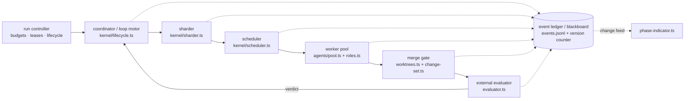
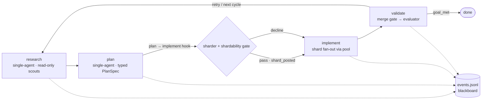

# 3. Target Deployment Architecture

This chapter assembles Chapters 4–6 into one target architecture for `joeott/pi-iterative-goal` at `main` @ `c6a3b75`. Section 3.1 fixes the topology and its ownership rule; Section 3.2 shows where each module attaches to the four-phase loop; Section 3.3 argues the hash-chained event ledger is the coordination substrate — a blackboard with a deliberately minimal publish/subscribe primitive. Per the finding of Section 2.3, every stage wires a verified seam or promotes a dormant asset; none requires a new storage layer, policy vocabulary, or isolation primitive.

## 3.1 Topology: one owner per decision

*Figure D2 — Deployment topology. Solid edges: control flow; dotted: ledger reads/writes.*

The chain is a strict separation of concerns: each stage owns exactly one class of decision, persisted to the ledger before the next stage acts. The **run controller** is the run-scoped root: it owns the goal lifecycle and the budget/lease envelope. Every privileged effect passes through `src/capabilities/broker.ts → CapabilityBroker.invoke` under `src/policy/engine.ts`, and per-task grants use the existing lease vocabulary — `PolicyDecision.lease` (`CapabilityLease { runId, taskId?, effect, resource, maxUses, expiresAt }`, named by `ActionRequest.taskId?`; Section 2.1) — and expiry cancels the holder and releases its write scopes (Section 5.4). The policy engine itself is consumed unmodified.

The **coordinator**, the existing loop motor `src/kernel/lifecycle.ts`, owns phase advancement and nothing else: it fires the sharder hook at the plan→implement transition, applies verdicts, and never reorders work within a phase. The **sharder** owns decomposition: coupling graph, spectral partition, shardability gate (Sections 6.2–6.3). The **scheduler** owns ordering and assignment — HEFT ranks, contract-net bidding, telemetry costs (Sections 6.4–6.5) — and drives the pool without executing. The **worker pool** — the long-lived `src/agents/pool.ts` instance — owns execution: role profiles, `activeWriteScopes`, one isolated worktree per writer (Sections 5.1–5.2). The **merge gate** owns integration: patch application in HEFT order, per-shard `verifyImplementationAgainstPlan`, the test suite (Section 6.6). The **external evaluator** owns completion: the unfinished-work gate extends so that any shard not `merge_verified` blocks `goal_met`, preserving the judge-independence rule (evaluator model ≠ actor model).

The ownership rule keeps the topology operable by a solo maintainer: every stage's output is a typed ledger event, so the pipeline is replayable from `events.jsonl` and headlessly testable (Section 2.1), and a defect corrupts only one decision class — HEFT's missing dominance guarantee stays inside the scheduler, whose periodic re-plan (Section 6.5) can override any assignment.

## 3.2 The instrumented loop

*Figure D1 — The instrumented four-phase loop. Solid edges: phase transitions; dotted: ledger appends.*

The sequencing invariant is the load-bearing rule of the deployment: sharding activates only after the research and plan artifacts are committed. Research and plan remain single-agent; the supervisor may consult read-only scouts (workspace mode `read_only_snapshot`, typed claims/sources output, Section 5.2), but decomposition is never delegated. Fan-out first becomes possible at the plan→implement transition, where the sharder hooks `src/kernel/lifecycle.ts → advanceToNextPhase()` (the Section 2.2 seam, mirroring the existing `verifyImplementationAgainstPlan` special-case), and only after the plan phase commits a typed `PlanSpecSchema` via `goal_post_shards` as `shard_posted` (Section 6.1). The gate has two exits: pass, and implement executes the shard DAG through the pool; decline — the cheapest balanced cut severs too many edges — and implement keeps its single-slice behavior at zero cost. This asymmetry deploys the Section 5.3 counter-evidence: fan-out is the exception that must justify itself, not the default.

Every transition in D1 already appends an event today; the deployment extends the taxonomy rather than inventing instrumentation. The table maps modules to attach points and gaps closed (Section 2.2 change map).

| Module | New or modified | Attach point | Gaps closed |
|---|---|---|---|
| `src/ui/phase-indicator.ts` | New | Consumes the StateManager change feed; sole writer to status bar, widget, header, dashboard | G1–G6 |
| `src/state.ts` | Modified | Version counter in `appendEvent`; `subagent_*`/`shard_*`/`merge_*` events plus replay handlers | G2–G5, S6 |
| `src/dashboard.ts`, `src/harness-ui.ts` | Modified | Goal/phase rendering deleted; non-goal startup content retained | G6 |
| `src/kernel/lifecycle.ts` | Modified | Sharder hook in `advanceToNextPhase()`; imperative UI call sites removed | sharding seam (hook) |
| `src/phases.ts`, `src/ui/tools.ts` | Modified | Plan emits typed PlanSpec via new `goal_post_shards`; implement prompt iterates shards | sharding seam (prompts, intake) |
| `src/subagents.ts` | Modified | `tasks[]` and `mode:"parallel"\|"chain"` wired to `pool.map`; ledger emission per task | S1, S6 |
| `src/agents/pool.ts` | Modified | Long-lived per-run instance; cross-call `activeWriteScopes`; detected-backend dispatch | S2, S4, S5 |
| `src/agents/roles.ts` | New | Per-role tool/budget/output-schema profiles (Section 5.2) | swarm enabler |
| `src/domain/shard.ts` | New | `ShardSchema`/`ShardPlanSchema` extending the dormant `PlanSpecSchema` | sharding seam (contract) |
| `src/kernel/sharder.ts` | New | Invoked from the lifecycle hook; consumes the committed PlanSpec | sharding seam (decomposition) |
| `src/kernel/scheduler.ts` | New | Drives the pool; consumes `AgentTask.dependsOn` and `subagent_finished` telemetry | S3 |
| `src/workspace/worktrees.ts` | New (promoted) | `prepareIsolatedWorktree()` promoted from `pool.ts`; adds apply/merge-back, prune recovery | S6 |
| `src/workspace/change-set.ts` | Modified | `verifyImplementationAgainstPlan` run per shard at the merge gate | sharding seam (verification) |
| `src/evaluator.ts` | Modified | Unfinished-work gate extended to shards not `merge_verified` | sharding seam (completion) |
| `src/types.ts` | Modified | Subagent run-state types backing `subagent_*` replay handlers | S3, S6 |
| `src/ui/goal-commands.ts` | Modified | Imperative `updateStatusBar`/`updateWidget` call sites removed | G2–G4 (call-site cleanup) |
| `src/policy/engine.ts`, `src/capabilities/broker.ts` | Unmodified (consumed) | Lease vocabulary issued per shard; no code change | dormant asset activated |

The distribution is the point. Six modules are new, but five are promotions of verified dormant assets (`shard.ts` extends `PlanSpecSchema`; the scheduler consumes `AgentTask.dependsOn`; `worktrees.ts` promotes `prepareIsolatedWorktree()`; the sharder consumes the plan schema; the indicator renders ledger-held state), leaving `roles.ts` the only genuinely novel content. Twelve files are modified at seams verified in Chapter 2 — the riskiest touches (`lifecycle.ts`, `state.ts`) sit where the smoke runner already has regression coverage — and two policy files are consumed unchanged. The table doubles as the Section 2.3 scope-enforcement device: proposals fitting no row are out of scope. Two of these files changed on `main` on 2026-06-29; rebase on `c6a3b75` (Section 4.2).

## 3.3 The blackboard: ledger as coordination substrate

The coordination model is a blackboard: a shared, durable workspace that independent knowledge sources read and write, in the classical formulation [^nii1986^]. The repository already ships the substrate: `events.jsonl` is append-only and hash-chained (`appendEvent` attaches `sequence`, `previousEventHash`, and a sha256 `eventHash`; `verifyEventHashChain` fails closed on tamper), and the `replayHandlers` table rebuilds full state after compaction or restart (Section 2.1). Shard, swarm, and UI state are projections of one record — hence no new storage layer in the attachment table.

The blackboard's documented hard problem is control — which knowledge source acts when [^nii1986^] — answered here by construction rather than a control module: the HEFT scheduler decides ordering (Section 6.4), typed `shard_*`/`merge_*` schemas decide what may be written, and provenance fields (`runId`, `taskId`, `TaskPlanState.updatedByPhaseAttemptId`) decide authorship. The arbiter of done is the merge gate plus the evaluator's unfinished-work gate, not the blackboard: the log records claims; the gates verify them.

Publish/subscribe — the ledger's one missing mechanism, since consumers cannot watch the log and everything is imperative pull — is closed by the smallest primitive: a monotonic version counter incremented inside `appendEvent`, consumed by the 1 Hz UI ticker (Section 4.2). One integer is a complete invalidation signal precisely because the store is event-sourced: no producer can forget to notify. It serves three subscriber classes — `phase-indicator.ts` repaints, the scheduler re-plans on telemetry drift (Section 6.5), the merge gate triggers on `shard_completed` — without a broker or per-call-site wiring.

Safety discipline is schema plus provenance. LLM-era blackboard experience warns that a shared writable channel is the principal surface for error cascades — one agent's plausible mistake becomes every other agent's context [^blackboard-llm-2025^] — so the deployment admits only schema-validated typed events — never free-form text — stamped with provenance and covered by the hash chain. Chapters 4–6 detail each producer and subscriber; Chapter 8 sequences the rollout.
