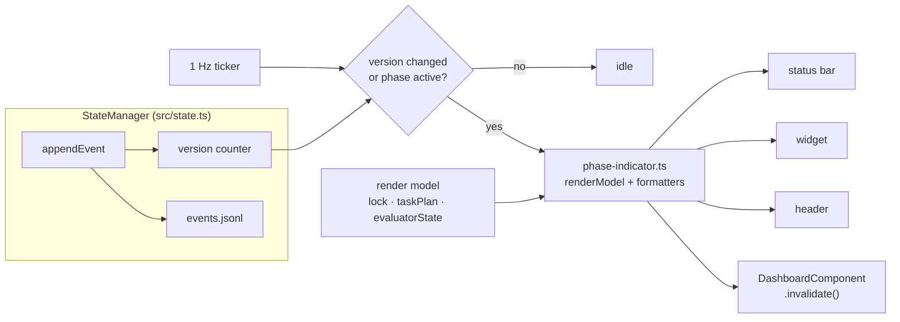

# 4. UI Visibility: Clean Live Phase Rendering in the Pi TUI

This chapter specifies how the requirement "the phases the goal is presently in, cleanly rendered in the pi ui" is implemented for `joeott/pi-iterative-goal`. The design consolidates phase rendering into one module, `src/ui/phase-indicator.ts`, driven by a StateManager change feed (a monotonic version counter) and a 1 Hz UI ticker. All repository claims below are verified facts from the anatomy read of `main` @ c6a3b75; gap identifiers G1–G6 refer to the current-state assessment in Chapter 2.

## 4.1 Problem: six verified rendering defects

The structural root cause is that UI refresh in the harness is **imperative and transition-triggered**. `src/dashboard.ts → updateStatusBar(ctx, state)` and `updateWidget(ctx, state)` are invoked only from `src/kernel/lifecycle.ts → advanceToNextPhase()` (after `setPhase`), `handleValidateTransition()` (post-verdict, on all four outcome paths), the synthetic-failure pause path, the `session_start` restore, and command handlers in `src/ui/goal-commands.ts`. There is no `setInterval` anywhere in `src/` (verified, zero matches), and StateManager exposes no subscribe/notify mechanism. Six defects follow:

**G1 — stale always-visible header.** `src/harness-ui.ts → renderStartupUi()` fires only on `session_start` and `model_select`; `setHeader(() => new HarnessHeader(...))` captures cycle/phase/status at construction, and `src/harness-ui.ts → HarnessHeader.invalidate()` is an empty no-op. The most prominent phase display therefore shows the wrong phase for the entire run.

**G2 — no in-phase liveness.** `lock.phaseStartedAt` and `PhaseAttempt.startedAt` exist, but nothing renders elapsed time or a heartbeat during a phase; long phases present a frozen line. `src/kernel/workflow-engine.ts → startPhaseAttempt()` never touches the UI.

**G3 — evaluator running state invisible.** `evaluatorState` (`queued|running|passed|failed|error|stale_heartbeat`, heartbeat maintained by `src/evaluator.ts → updateEvaluatorHeartbeat`) appears only in the modal dashboard and `/goal-status --json`; `updateStatusBar`/`updateWidget` read only `lastVerdict`.

**G4 — task plan hidden from chrome.** The in-progress `TaskPlanItem` is absent from status bar and widget; `src/ui/tools.ts → goal_update_task_plan` emits a `task_plan_updated` event but triggers no repaint.

**G5 — fake progress.** `src/dashboard.ts → calculateProgress()` returns `min(95, (cycle−1)·100/(cycle+2))` — a cycle-only heuristic that ignores the four-phase cycle position and `taskPlan` completion.

**G6 — dual UI ownership.** `src/dashboard.ts` (surface IDs `iterative-goal`) and `src/harness-ui.ts` (`iterative-goal-harness`, `iterative-goal-startup`) each render the goal/phase line with different freshness guarantees; neither subscribes to state.

## 4.2 Design: one renderer, one change feed, one ticker

**(a) Consolidate rendering.** A new module `src/ui/phase-indicator.ts` becomes the single owner of all goal/phase content on the status bar, widget, header, and modal dashboard. It exposes a pure `renderModel(state) → RenderModel` projection plus per-surface line formatters, so output is testable without a terminal. `src/harness-ui.ts` retains only non-goal startup content (mode, model, subagent backend); its duplicated goal/phase line is deleted. This fixes G6 by construction.

**(b) Add a change feed to StateManager.** Add a monotonic `version` counter in `src/state.ts`, incremented inside `appendEvent` before hash chaining and exposed as `getVersion()`. Because the store is event-sourced — every mutation (phase, verdict, evaluator state, task plan, status) already flows through `appendEvent` into `events.jsonl` — the counter is a *complete* invalidation signal: no call site can forget to notify. This is deliberately one integer, not a pub/sub framework.

**(c) Add a 1 Hz UI ticker.** On `session_start`, register `setInterval(tick, 1000)` — the first interval timer in `src/`, added deliberately — and clear it on session teardown. Each tick reads `getVersion()` and re-renders all surfaces if the version changed since the last render, or if a phase attempt is currently active so that the elapsed-time field advances at one-second granularity even when zero new events arrive (G2). When the run is paused or idle, a tick costs one integer comparison and emits nothing. Event-driven invalidation then needs no per-call-site wiring: `phase_changed`, `evaluator_state_updated`, `task_plan_updated`, and `status_changed` all bump the version and are picked up within one second. This fixes G1, G3, and G4.

One constraint is stated honestly: whether Pi's `ctx.ui.setHeader` re-invokes its factory or honors a component's `invalidate()` on state change is **unverified framework behavior** (verification flag 2 in the anatomy). The ticker is chosen precisely because it pushes `setStatus`/`setWidget`/`setHeader` explicitly on every invalidating tick and therefore does not depend on framework push semantics. `HarnessHeader` is refactored to receive a `() => RenderModel` accessor with a real `invalidate()`; if header re-render proves inert, the fallback is re-calling `setHeader` per tick with a fresh factory — cheap, and encapsulated inside `phase-indicator.ts`.

**(d) Make the modal dashboard live.** `src/dashboard.ts → DashboardComponent` currently snapshots state at construction, and its `invalidate()` is never invoked on state change. Convert it to re-read state inside `invalidate()`, and have the ticker invoke `invalidate()` whenever the modal is open and the version changed. The static `HarnessDashboard` (startup information only) is explicitly out of scope.

**Migration.** Once the ticker lands, delete the imperative `updateStatusBar`/`updateWidget` call sites in `kernel/lifecycle.ts` and `ui/goal-commands.ts`; they are redundant because every one of those paths already appends an event. `goal-reset → clearStatusBar` is preserved as a rendered-empty state following `status_changed`. The UI files (`dashboard.ts`, `harness-ui.ts`) changed on `main` on 2026-06-29; rebase on `c6a3b75` before starting.

## 4.3 Render specification

The table fixes the exact content and refresh trigger per surface; `RenderModel` carries `lock`, `taskPlan`, `evaluatorState`, phase, cycle, verdicts, blockers, and errors.

| Surface | Content | Refresh trigger |
|---|---|---|
| Status bar (`setStatus("iterative-goal")`) | `🎯 C{cycle} {icon} {phase} {elapsed} · task {done}/{total} · shards {done}/{total} · eval {state}` | Every tick while a phase attempt is active; otherwise only on version change |
| Widget (`setWidget("iterative-goal", …, belowEditor)`) | Goal line; `C{cycle} {icon} {phase} · {status}`; `▸ {in-progress task title}`; `eval {state} · hb {age}s`; last verdict + next focus; ≤2 blockers; ≤2 errors | Version-changed ticks only |
| Header (`HarnessHeader`) | `goal: C{cycle} {icon} {phase} {status} {elapsed}` | Every tick while active; on version change otherwise |
| Modal dashboard (`/goal-dashboard`) | Existing snapshot content re-read live, plus heartbeat age and per-phase elapsed | Version-changed ticks while the modal is open |

The refresh asymmetry is a deliberate cost/flicker trade-off. The status bar and header are single-line surfaces where a one-second repaint is imperceptible, so they carry the wall-clock fields (`{elapsed}`, defined as `mm:ss` from `Date.now() − lock.phaseStartedAt`, falling back to the open `PhaseAttempt.startedAt`). The widget is a multi-line block below the editor where per-second churn would be distracting, so it refreshes only on state change; its heartbeat age (`hb {age}s`, seconds since the last `updateEvaluatorHeartbeat`) is therefore as-of-last-event, which is acceptable because evaluator activity itself generates `evaluator_state_updated` events. In `eval {state}`, the renderer displays `evaluatorState.status` verbatim, prefixing `⚠` when the status is `stale_heartbeat` or `error` — staleness detection stays in `src/evaluator.ts`, and the UI merely surfaces it, fixing G3 without duplicating threshold logic. `task {done}/{total}` counts completed over non-cancelled `state.taskPlan.items`, and `▸ {title}` shows the single `in_progress` item the state enforces (G4). `shards {done}/{total}` is rendered only when a shard plan exists for the cycle — dormant until Chapter 6's `shard_posted`/`shard_completed` events land — so the format is forward-compatible without speculative state. Finally, `calculateProgress()` is replaced by $\mathrm{pct} = \mathrm{round}(100 \cdot (i + f)/4)$, where $i$ is the current phase's index in the four-phase cycle (research, plan, implement, validate → 0–3) and $f$ is taskPlan completed/total during implement, else 0 (G5). The value is monotonic within a cycle and renders 100% only on `goal_met`.

## 4.4 Data flow and acceptance checks

*Figure D3 — UI change-feed data flow. The ticker polls the version counter; surfaces push on change or active-phase ticks.*

D3 shows the data flow: every mutation enters through `appendEvent`, which bumps the version counter; the ticker polls the counter once per second and, on change or active-phase ticks, pulls a fresh render model and pushes all four surfaces. Acceptance checks for this chapter:

1. **A1 (G1).** Header and status bar show the new phase within 1 s of a `phase_changed` event, with no manual command.
2. **A2 (G2).** During a 60 s phase with zero new ledger events, `{elapsed}` advances every second in status bar and header.
3. **A3 (G3).** An `evaluator_state_updated` with status `running` appears in the status bar within 1 s; `stale_heartbeat` renders with the `⚠` prefix.
4. **A4 (G4).** A `task_plan_updated` event makes `▸ {title}` appear in the widget within 1 s.
5. **A5 (G5).** Rendered percent is non-decreasing within a cycle and advances as `taskPlan` items complete; `goal_met` renders 100%.
6. **A6 (G6).** `grep` confirms only `src/ui/phase-indicator.ts` references the surface IDs `iterative-goal`, and `harness-ui.ts` contains no goal/phase line.
7. **A7.** `npm run smoke` is extended in `scripts/smoke-goal-harness.mjs` with a fake-API render test: a recording `ctx.ui` stub (`setStatus`/`setWidget`/`setHeader`), a temp-dir StateManager, and an exported `tickOnce()` drive `phase_changed`/`evaluator_state_updated`/`task_plan_updated` and assert the exact line formats of §4.3.
8. **A8.** With the run paused, ten consecutive ticks produce zero render calls (idle cost is one integer comparison per tick).
