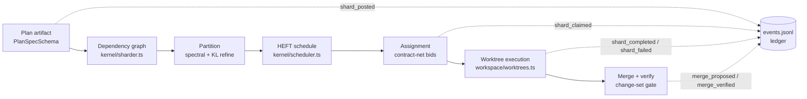
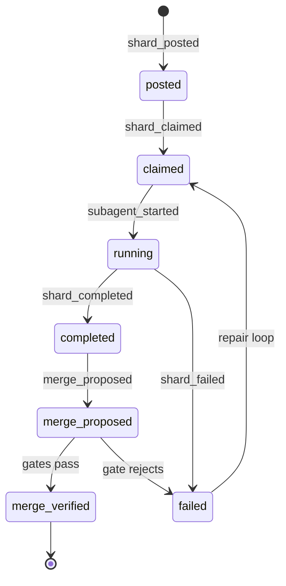

# 6. Post-Plan Sharding Pipeline

This chapter specifies the pipeline that converts a completed plan phase into conflict-free parallel execution: how the harness decomposes planned work into shards, orders them, assigns them to pool workers, and merges the results. The pipeline activates once per cycle at the plan→implement transition; every stage persists its decisions to the event ledger, so the sequence survives context compaction and restart. Figure D4 shows the flow.

*Figure D4 — Post-plan sharding pipeline. Dashed edges are ledger writes.*

## 6.1 The attach seam: plan → implement

The sharder hooks the exact plan→implement transition, `kernel/lifecycle.ts → advanceToNextPhase()`, mirroring the existing `if (state.phase === "implement") verifyImplementationAgainstPlan` special-case in the `agent_end` handler. Two preconditions make the hook meaningful.

First, the plan phase must emit a typed artifact rather than free text. The plan prompt (`src/phases.ts → renderPlanPrompt`) already demands an exact-files allowlist; the deployment upgrades this to a `PlanSpecSchema` JSON document recorded through a shard-aware posting tool (`goal_post_shards`, `src/ui/tools.ts`). The schema exists today in `src/domain/plan.ts` — `PlanSpecSchema { id, version, tasks[], createdAt }` with `PlanTaskSchema` carrying `dependsOn[]`, `allowedPaths: PathScope[]`, `requiredCapabilities[]`, `checks`, and `risk` — yet is referenced nowhere else in the repository: wiring it is activation of a designed-but-dormant contract, not invention. `src/domain/shard.ts` then defines `ShardSchema`/`ShardPlanSchema` as the shard-level extension. The flat `state.taskPlan` checklist remains a weaker secondary source, since it loses `dependsOn`/`allowedPaths` typing.

Second, durability: each shard record is committed to the hash-chained `events.jsonl` via `shard_posted` (`src/state.ts → appendEvent`), so the shard plan is rebuilt by `replayEvents()` after compaction or restart rather than living in volatile prompt state. Before partitioning, the shardability gate inspects coupling density: if the cheapest balanced cut severs a large fraction of all edges, the work is tightly coupled, fan-out is declined, and the implement phase keeps its single-slice behavior (`src/phases.ts → renderImplementPrompt`).

## 6.2 Dependency graph construction

`src/kernel/sharder.ts` builds an undirected weighted graph $G = (V, E, w)$. Vertices are the union of files across the plan tasks' allowlists (`PlanTaskSchema.allowedPaths: PathScope[]`), normalized by the path-scope machinery (`src/domain/path-scope.ts → normalizeRepoPath`) that verifies implementation diffs today. Edges are static import/reference relationships resolved through the repository-context capability (`goal_repo_context`), symmetrized ($A_{ij} = A_{ji}$) since an import in either direction signals coupling. Weights in v1 are reference counts; co-change weights from git history are a documented v2 refinement — v1 accepts that dynamic coupling is invisible to a static import graph. Task-level `dependsOn` constraints feed the scheduler (§6.4) but create no graph edges: the graph captures code coupling, not task order. Files in no allowlist are excluded — readable by all, writable by none (the writer-allowlist invariant of `src/subagents.ts → registerGoalSubagentTool`).

## 6.3 Partitioning: spectral prior plus local refinement

The objective is a balanced $k$-way cut of minimum weight, because every cut edge is a cross-shard contract — an interface two agents must not change simultaneously. Exact balanced minimum bisection is NP-hard, with no constant-factor approximation under a perfect balance constraint [^buluc2016^], so the sharder uses a two-stage heuristic: a spectral bisection prior followed by greedy local refinement, with $k$-way partitioning by recursive bisection.

**Stage 1 — spectral prior.** Form the graph Laplacian:

$$L = D - A$$

where $A$ is the symmetrized adjacency matrix and $D$ the diagonal degree matrix, and solve the eigenproblem:

$$L v = \lambda v$$

The eigenvector $v_2$ belonging to the second-smallest eigenvalue $\lambda_2$ — the Fiedler vector, introduced as the graph's algebraic connectivity [^fiedler1973^] and operationalized as a partitioning method by Pothen, Simon and Liou [^pothen1990^] — assigns each vertex a scalar coordinate. The bisection rule is:

$$\text{Shard}(i) = \begin{cases} A & \text{if } v_2[i] \geq 0 \\ B & \text{if } v_2[i] < 0 \end{cases}$$

with a median split substituted when the sign split violates balance tolerance $\varepsilon$ (default 0.34, at most a 2:1 size ratio).

**Stage 2 — refinement discipline.** Spectral bisection is used only as a prior: it is expensive in running time and dominated in practice by multilevel partitioners with local refinement — hMETIS in the VLSI domain [^karypis1999^] and KaHIP, whose lineage holds most Walshaw benchmark records [^sanders2011^][^buluc2016^]. Harness graphs are small (tens of files), so multilevel coarsening is unnecessary; what must be retained is the second ingredient, local search. Each pass computes per-vertex gains $D(v) = \text{external}(v) - \text{internal}(v)$, evaluates Kernighan–Lin-style swaps $g(a, b) = D(a) + D(b) - 2c(a, b)$, executes the best positive-gain swap that keeps imbalance within $\varepsilon$, and stops when no improving swap exists.

**Worked example.** A plan's allowlists name six files: an auth module (f1 `login.ts`, f2 `session.ts`, f3 `token.ts`) and a billing module (f4 `invoice.ts`, f5 `refund.ts`, f6 `stripe.ts`). Import edges form two triangles plus one bridge, f3–f4 (`invoice.ts` imports `token.ts` to attribute the caller).

| Vertex | File | Adjacent (A) | deg | $L$ row | $v_2[i]$ | Sign | Shard |
|---|---|---|---|---|---|---|---|
| f1 | auth/login.ts | f2, f3 | 2 | [2, −1, −1, 0, 0, 0] | −0.465 | − | B |
| f2 | auth/session.ts | f1, f3 | 2 | [−1, 2, −1, 0, 0, 0] | −0.465 | − | B |
| f3 | auth/token.ts | f1, f2, f4 | 3 | [−1, −1, 3, −1, 0, 0] | −0.261 | − | B |
| f4 | billing/invoice.ts | f3, f5, f6 | 3 | [0, 0, −1, 3, −1, −1] | +0.261 | + | A |
| f5 | billing/refund.ts | f4, f6 | 2 | [0, 0, 0, −1, 2, −1] | +0.465 | + | A |
| f6 | billing/stripe.ts | f4, f5 | 2 | [0, 0, 0, −1, −1, 2] | +0.465 | + | A |

The Fiedler value $\lambda_2 = (5 - \sqrt{17})/2 \approx 0.438$ is small, quantifying how weakly the modules hold together, and the vector magnitudes localize the seam: bridge endpoints f3 and f4 carry the smallest $|v_2[i]|$ (0.261 against 0.465 for the leaves) — the natural interface files, whose edits the merge gate will scrutinize hardest. The sign split yields a balanced 3/3 partition with cut weight 1, leaving f3–f4 as the only cross-shard contract. One refinement pass then checks all nine cross-shard swaps: $D$ values are −1 for f3 and f4 and −2 for the leaves, and the best candidate (f1↔f4) has gain $-1 + (-2) - 2(0) = -3 < 0$, so no swap executes and the prior is confirmed locally optimal. That the prior alone suffices here is a property of the instance, not of the method: on noisier graphs, refinement converts a global hint into a defensible local optimum, and balance tolerance keeps the relaxation honest given that exact bisection is NP-hard [^buluc2016^].

## 6.4 Scheduling: HEFT with telemetry-calibrated costs

The partition, inter-shard edges, and task-level `dependsOn` constraints form a DAG of shard steps. `src/kernel/scheduler.ts` orders it with HEFT (Heterogeneous Earliest Finish Time), the standard list-scheduling heuristic and still the reference baseline two decades on [^topcuoglu2002^][^saga2024^]. Each step's priority is its upward rank, computed backward from the exit step:

$$rank_{up}(n_i) = \overline{w_i} + \max_{n_j \in \text{succ}(n_i)} \left( \overline{c_{i,j}} + rank_{up}(n_j) \right)$$

Steps are listed by decreasing rank (critical path first) and placed on the worker giving the earliest finish time:

$$EFT(n_i, r_k) = \text{ReadyTime}(r_k) + w_{i,k}$$

The mapping is direct: $n_i$ are shard steps, $r_k$ are workers of the long-lived agent pool (Chapter 5), $\overline{w_i}$ is mean execution cost, and $\overline{c_{i,j}}$ is the artifact hand-off cost between dependent steps. Scheduling consumes the dormant `AgentTask.dependsOn` field (`src/agents/pool.ts → AgentTask`) — DAG plumbing that exists today with no reader.

Two honesty constraints govern the cost model. First, HEFT is static: decisions are only as good as their a priori estimates, and quality degrades under uncertain estimates [^canon2008^]. The scheduler therefore calibrates $\overline{w_i}$ and $w_{i,k}$ from measured telemetry, not guesses — every subagent run returns per-run counters in `src/agents/pool.ts → AgentResult.usage` (`{ input, output, cacheRead, cacheWrite, cost, turns }`), persisted with each `subagent_finished` event as an empirical cost distribution per role and model profile. Second, HEFT carries no dominance guarantee — adversarial instances run about 4.3× worse than a trivial baseline [^saga2024^] — so its ordering is a default, never a proof: when telemetry drifts beyond threshold, ranks for unstarted steps are recomputed (the periodic re-plan of §6.5).

## 6.5 Assignment: contract-net bidding as a satisficing layer

Within the HEFT order, worker selection uses Contract-Net-style bidding [^smith1980^], the market-style allocation protocol standardized as a FIPA agent interaction protocol [^fipa2002^]. The scheduler announces a shard step to a targeted shortlist — workers whose role and permitted effects match the step's `PlanTaskSchema.requiredCapabilities`, not a broadcast — candidates bid, and the award maximizes total utility:

$$\max \sum_{i} \sum_{j} x_{i,j} \left( \alpha \cdot \text{Cap}_{i,j} - \beta \cdot \text{Cost}_{i,j} \right) \quad \text{s.t.} \quad \sum_{i} x_{i,j} = 1 \;\; \forall j$$

Here $x_{i,j} \in \{0,1\}$ flips on the assignment of step $j$ to worker $i$; $\text{Cap}_{i,j}$ scores capability and tool match; $\text{Cost}_{i,j}$ is the telemetry-estimated cost from §6.4; and $\alpha, \beta$ are policy dials — high $\alpha$ prices accuracy, high $\beta$ prices thrift.

The evidence constrains how far this layer is trusted. Market-based allocation is fast, flexible, and failure-robust, but carries no global-optimality guarantee — "good local solutions may not sum to a good global solution" — and its coordination overhead grows steeply with team size [^dias2006^]. Bidding is therefore strictly satisficing: (i) announcements go to a bounded shortlist of capable workers, matching the pool's concurrency cap; (ii) `src/kernel/scheduler.ts` acts as periodic global critic — on telemetry drift or shard failure it re-runs the global HEFT view and may reassign unstarted work, restoring the coherence local bids cannot provide [^dias2006^]; and (iii) every award is ledgered as `shard_claimed`, making allocation auditable and replayable.

## 6.6 Execution isolation, merge-back, and the shard lifecycle

Each claimed shard step executes in an isolated git worktree. The primitive exists exactly once in the repository — `src/agents/pool.ts → prepareIsolatedWorktree()`: `git worktree add --detach` into a temporary directory, patch capture via `git diff --binary`, and a process-exit cleanup registry — but it lacks apply/merge-back and shard-lifetime management. The deployment promotes it to `src/workspace/worktrees.ts`, adding patch application onto an integration branch in HEFT order, `git worktree prune` recovery for crashed runs, and per-shard write scoping in the policy engine's lease vocabulary (`src/policy/engine.ts → PolicyDecision.lease`). Vendor practice validates the model — parallel agent sessions in worktrees so concurrent edits do not collide [^claude-code-worktrees-2025^][^conductor-2025^] — and is explicit about its limit: isolation defers conflicts to merge time rather than eliminating them [^conductor-2025^].

Verification therefore concentrates in the merge layer. A completed shard emits `merge_proposed`, triggering a three-part gate: (1) per-shard `verifyImplementationAgainstPlan` (`src/workspace/change-set.ts`) checking the diff against the shard's path-scope allowlist; (2) the repository test suite; and (3) the evaluator's unfinished-work gate (`src/evaluator.ts`), which today blocks completion while any task item is unfinished, extended so that any shard not `merge_verified` blocks `goal_met`. Gate rejection returns the shard to `claimed` for repair with failure evidence attached. Figure D5 shows the full lifecycle.

*Figure D5 — Shard lifecycle. The repair loop returns failed or gate-rejected shards to `claimed`; only `merge_verified` shards count toward goal completion.*

**Ledger as blackboard.** All shard state transitions ride the append-only, hash-chained `events.jsonl` (`src/state.ts → appendEvent`; `verifyEventHashChain` fails closed on tamper, and the replay-handler table rebuilds shard state after compaction). This is the blackboard pattern — a shared workspace that independent knowledge sources read and write — whose documented hard problem is control: deciding which source acts when [^nii1986^]. Here control is answered by construction: the HEFT scheduler decides ordering, typed `shard_*` schemas decide what may be written, and per-record provenance (`taskId`, `runId`) decides authorship. LLM-era evidence adds the standing warning that a shared writable channel is also the principal surface for error cascades [^blackboard-llm-2025^] — hence schema-validated events rather than free-form text, and a merge gate, not the blackboard, as the arbiter of done.
